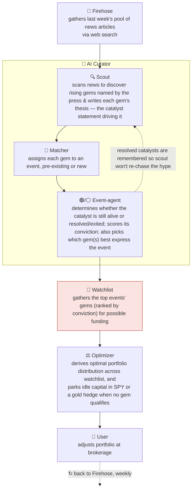

# geo-herd-rider

**Author:** Joe Hahn  
**Email:** jmh.datasciences@gmail.com  
**Date:** 2026-Jun-23 <br>
**branch:** main

**Our model of the market.** Two groups move a price. The **smart money** (insiders and genuinely expert investors) have a real edge, they get to move first and they reap the greatest rewards. Then the **slow herd** arrives late to pile in and flatten the opportunity. We are neither. We have no inside information and no deep-investor edge, but we do have **data** (news, posts, reports, prediction markets) and **AI to manage and interpret that data**. Our play is to use that data's leading indicators to infer *where the smart money is already heading* and position us **between the smart money and the herd**. But because we must first discern where the smart money is headed, we inevitably arrive a bit late, but with the goal of arriving early enough to capture some of the move before the slow herd arrives and prices it away. And just as we ride in ahead of the herd, we also ride out as it shows up. Once the herd piles in and flattens the opportunity, that position has done its work and so we pivot off to the next event whose opportunity is still un-grazed.

**The core idea.** We don't reason out a causal chain to *find* the next winner — the financial press already publishes the answer, by ticker, naming the winner **early** (while it's still under the radar) and then repeatedly, more loudly, as the move builds. For example, the niche tanker-freight ETF (BWET) was named in print as a standout trade — *"the best-performing ETF of 2026 … flown under the radar"* — weeks before it tripled again. Our edge is simply to be **reading**: enter when the press names a ticker on a *live* thesis — a *thesis* being the specific catalyst driving the ticker (here, a war spiking tanker freight rates), *live* while that catalyst is unresolved — ride while the thesis holds, and exit when the catalyst resolves. AI is never used to predict *how big* a move will be — only which ticker or tickers to monitor, and whether its thesis still holds, while a non-AI mechanical optimizer sizes it.

**What this repo does.** Walking week by week, an LLM reads the news firehose, extracts the US-listed tickers the press explicitly **names** as thesis-driven movers, and curates a watchlist. A standard portfolio optimizer then decides **how much to hold of each name** — sizing them from their recent returns and volatility (using the same math that robo-advisors utilize). A position is **held while its driving catalyst is live** and **dropped when the driver behind the rise goes away** (ceasefire signed, chokepoint reopens). This whole solution is then backtested against a curated set of about a dozen historical thesis-driven events and the tickers (designated as **gems**) that they drove.

## How it works, at a glance

This solution is one short assembly line that loops weekly. It reads the news firehose to spot the **events** the press is flagging. Each event is driven by a **catalyst** — a discrete cause such as a war, an election, or a supply shock — and that catalyst causes specific tickers (which we designate as **gems**, named explicitly by the journalists covering the event) to rise. A gem's **thesis** is just *why* it's rising — the claim that this catalyst is driving this ticker. A **scout** discovers the events and writes each gem's thesis; a **matcher** groups each week's named tickers into the events already in flight; and then an **event-agent** **tracks each event over time** — an event can last weeks, months, or years, and the gem that best expresses it can *change* as it unfolds. We invest in a gem while its thesis is **live** (the catalyst still active/unresolved) and **exit** (drop the position) when the catalyst **resolves** (the war ends, the chokepoint reopens, the bill is signed) — and it is the **event-agent that writes this exit call**, arguing each week whether the catalyst has already happened and dropping the position the moment it has. A **plain optimizer** (never the AI) then sizes whatever is held.



The whole assembly line **runs once per `rebalance_days` (default 7 = weekly)** and marches week by week across the era. Each pass re-reads the firehose, the event-agents re-ask *"is this event's thesis still live, or has it resolved?"*, each agent then names the gem or gems that best express the event it is monitoring (and those gems can change over time), and then the optimizer rebalances the portfolio — **sizing is mechanical; the AI never sets the position sizes** (it only names tickers and the hold/exit call). An event isn't rediscovered from scratch each week: its agent remembers what it concluded last week (its prior-week note), and the position stays on (a "sticky hold") through quiet weeks — so each event is tracked continuously until its agent calls the exit. The exit is **resolution-driven, not crowd-driven** (we drop on the catalyst *resolving* — war ends, bill passes). Each week the agent argues the devil's-advocate case that the catalyst has *already happened* and then answers a forced binary — *has the catalyst resolved, yes or no?* — and a yes drops the position **immediately** (a resolved catalyst is definitive, so it exits at once rather than waiting out the sticky-hold), even if the coverage is still loud. Between these hard exits, each agent's **[conviction](#conviction-how-its-scored-and-how-it-decays) (1–10)** rides up on fresh milestones and **decays** on silence or a priced-in market — the soft signal that feeds the competitive cull and the always-on **[SPY/gold floors](#how-the-core-pieces-fit-together)** (both explained in detail below). And once a catalyst resolves it is **remembered**: the scout is told which catalysts have already resolved (over the last `curator_memory_weeks`, default 8) so it won't **re-open the same ticker on lingering hype** after the catalyst is done (a ceasefire already signed isn't a fresh catalyst).

The red highlighted box is where our advantage comes from: the press has already flagged a live catalyst (the **event**) and named the tickers that express it (its **gem(s)**), so we never have to predict the winner ourselves — this solution just reads the ticker named by the press and rides it while its thesis holds.

The sections below explain the [Firehose](#the-news-firehose-why-reading-beats-reasoning) and the [AI Curator](#inside-the-curator-scout--event-agents) (its scout, matcher, event-agents) in greater detail.

### How the core pieces fit together

The above pipeline shows how the inputs and outputs are managed, while the following describes how an agent uses those inputs to monitor an event's datastream with an eye towards portfolio optimization. The main concept: one **event** (which is defined by its **catalyst**) is managed by an **AI agent** (which is the durable unit that this solution tracks) that maintains a **basket** of same-catalyst tickers. An example could be a rearmament catalyst → Rheinmetall + BAE + Saab + Thales, keeping in mind that the basket of tickers can evolve over time until the event's catalyst is resolved. Multiple event-agents can run concurrently, with each proposing their own baskets, and the surviving agents' tickers are gathered into the watchlist that the mechanical optimizer then sizes into a portfolio in a way that also tends to downweight the weaker tickers.

- An **event** is first flagged by the **scout**; it is the real-world thing that is unfolding, and it has a storyline that this solution is tracking (e.g. "Hormuz blockade").
- A **catalyst** is the event's spine that is documented by the **scout**. It is the continuous driver that runs through the entire event, preferably one that will ultimately resolve, with that resolution known as the **exit**. For the "Hormuz blockade" event the spine is *Iran's push to close the Strait of Hormuz*, and that event resolves with a *ceasefire*. An event can have multiple tickers associated with it, and they all share the same catalyst.
- **Milestones** are the vertebrae on the spine, they are the developments along the way (*protests in Iran → a US carrier group to the Med → strikes on Iran → the Hormuz closure itself*) that keep the catalyst *live* and feed the event's **conviction**. The **event-agent** tracks the milestones and its conviction week to week.
- **Conviction** is the event-agent's weekly rating (1–10) of how live and still-under-owned the catalyst is. Conviction is driven by the news. A fresh milestone can lift the agent's conviction, while silence, or news that the market has priced the move in, will cause conviction to decay over time.
- An **exit** can be declared by the agent that is monitoring the event, and it is where the milestone spine ends since the catalyst is resolved (e.g. the war ends, the bill is signed, the chokepoint reopens). Example: a ceasefire triggering an exit from the "Hormuz blockade" event. When the agent calls its own exit, its basket of tickers is no longer communicated to the live watchlist, which means the optimizer will not consider those exited tickers at the next portfolio rebalance. However this solution still preserves a memory of the resolved catalyst to prevent the scout from re-chasing that event as its news winds down during subsequent weeks.
- A **thesis** is the statement that connects the event to one or more tickers (e.g. this catalyst is causing that ticker to rise), and the thesis is authored by the **scout**.
- A **gem** is an in-demand ticker that benefits from the event. The **scout** names the gem or gems, and the **matcher** merges every ticker that names the same catalyst into ONE event (so that upticks by RNMBY and RHMTY and LMT are regarded as a single defense event rather than three distinct events) and assigns those same-event gems to the event's **basket**, which can evolve as the event unfolds since the event is pinned to the catalyst and not to any particular tickers. Each **event-agent** proposes its basket, and the agents are ranked by conviction (against each other and versus the always-on SPY/gold floors detailed below). This solution manages at most `max_agents` (currently 7) concurrent event-agents, so only the top-ranked agents survive while the lower-conviction agents fade away. And the surviving agents pour their tickers into the **watchlist**. A mathematical portfolio **optimizer** then assigns weights to those tickers in a way that tends to zero-out the weaker tickers.
- This solution provides two kinds of agents: (i) the **event-agents** described above that have fluid baskets; and (ii) the **always-on floor agents**, namely an ever-present **SPY floor agent** as well as the **configurable defensive agent** that by default favors GLD. These always-on single-ticker agents have a **fixed conviction** (default 5), which gives the optimizer the opportunity to fund safe harbors like SPY and/or GLD during moments when the event-agents are all low-conviction.

### Conviction: how it's scored, and how it decays

Every week each agent rates its **conviction** about its event, 1–10. A high conviction score means that the event has a **fresh, concrete, still-under-owned** catalyst that is delivering new milestones (a signed contract, a funding round, an escalation) that are driving towards resolution, while a low score means the event's driver is spent. Conviction is **remembered**: each agent sees its *own prior-week score* (a one-step memory carried in its journal note) and nudges it from there, so that the event's conviction trajectory is continuous and is not re-computed from scratch each week. Three forces determine an agent's conviction:

- **Hard exit — the catalyst *resolves*.** The devil's-advocate binary (*has the catalyst already happened?*) — a *yes* drops the position **immediately** (war ends, bill signed, chokepoint reopens), regardless of conviction or how loud the coverage still is. This is the only *instant* exit.
- **Priced-in decay — the market caught up.** When coverage flips from *"early / under-owned"* to *"fully valued / consensus"* while the catalyst is still structurally live, the agent steps conviction down toward 3–4 (`catalyst_resolved` stays *false* — it's a fade, not a resolution).
- **Silence decay — the firehose goes quiet.** On **each weekly refresh** (every `rebalance_days`) with **no fresh coverage** of the event's trend, conviction steps **down by 1 from the prior score** — so sustained silence **compounds** week over week toward the cull floor, while a single fresh trend-story **resets it back up**. This rests on the firehose thesis: the press covers live trends *loudly*, so silence is itself evidence the thesis is fading.

The soft decays lower an agent's **standing** until a competitive cull acts on it, detailed below. A fading event's falling score eventually drops it below another stronger event, or below one of the always-on floor agents, at which point it is retired.

## The news firehose: why reading beats reasoning

This solution doesn't screen all tickers to discover gems. The financial press already does that work and names the ticker, repeatedly, early while it's under the radar and then louder as the move builds. Here is BWET's news-history during the runup to the 2026 Iran war:

| Date | Outlet | Framing | from this date → peak |
|---|---|---|---|
| **Mar 4** | etf.com | *"best-performing ETF of 2026 … flown under the radar"* | **~3.2×** |
| Mar 20 | ETF.com | *"skyrocketing … still flying under the radar"* | ~2.3× |
| Apr 9 | Business Times | *"a 1,300% rally … an Iran war gauge"* | ~1.5× |
| Apr 25 | CNBC | *"up over 600% … better than oil or energy stocks"* | mainstream |

The progression in that last column, from "under the radar" to "everyone piling in", traces a gem moving from the smart money to the slow herd, and reading it early is the whole point. This solution enters the gems the press names on a live thesis and exits on thesis decay. The question "when to drop BWET?" answers itself: the position is dropped when the catalyst resolves (the Strait of Hormuz reopens, a ceasefire is signed) and freight rates roll over, not when the coverage merely gets crowded.

**Where the news comes from.** The firehose has two modes, and they must use different news sources, because reading historical news is a fundamentally different problem from reading this week's:

- **Live use (running the solution going forward, week to week).** The firehose is Anthropic web search, not a bulk download of every article published that week. Instead the curator answers a single question, *which tickers is the press naming as thesis-driven movers this week?*, by running its own web searches for exactly that, reading the headline and snippet of each result, and returning the tickers the press flags. From that one question Claude spawns its own follow-up searches (no fixed list; it adapts to whatever's live that week), capping every search to news dated today or earlier.

- **Backtest (replaying history to score this solution).** Here a normal web search is poison: searching old news today silently re-imports the future. Its date filters leak post-cutoff articles, its results are ranked by what later became famous, and it returns today's edited page rather than the original content. The goal is to assemble a representative news pool that is neither poisoned (no look-ahead) nor incomplete (it must include the early, under-the-radar phase, where the edge lives). That is why this solution uses GDELT, Wayback, and seeds:
  - **GDELT** is the only date-honest discovery index: it has server-enforced date bounds, and results ordered by date rather than relevance, so a gem's early article isn't boosted because it later mooned. GDELT is queried with a fixed list of 23 beats (superlatives, macro beats, the GICS sector sweep, and a small thesis-driven theme layer), never a ticker symbol:
    ```
    superlatives:  "best performing stock"  "biggest gainers"  "best performing etf"
    macro beats:   geopolitics  war  shipping  tariffs  "interest rates"
    sectors:       "technology stocks"  "energy stocks"  "financial stocks"
                   "healthcare stocks"  "industrial stocks"  "materials stocks"
                   "consumer stocks"  "utility stocks"  "real estate stocks"
                   "telecom stocks"
    themes:        cryptocurrency  "space stocks"  "robotics stocks"
                   "quantum stocks"  "nuclear stocks"
    ```
    The first three groups are gem-agnostic by construction, while the 10-beat sector sweep is derived from the 11 GICS sectors but with consumer staples and discretionary merged into a single consumer search term, plus commonly used market-wide superlatives, so that nothing is privileged. The themes group covers non-GICS asset classes and emerging-tech areas where gems emerge but the sector sweep is too coarse (quantum) or doesn't reach at all (crypto).
  - **But GDELT catches a gem late, not early.** It monitors a mostly-mainstream source list and surfaces a story only once it has propagated across those outlets, so the niche, low-readership early write-ups (the "BWET … under the radar" pieces) are under-indexed or absent, and a gem usually enters GDELT only after it has gone mainstream. GDELT also returns headlines only, and a headline names the theme, rarely the ticker.
  - So **Wayback** is used to patch the headline gap: for each URL GDELT did return, it fetches that page's as-of-date archived lede (which usually names the ticker). But it can't conjure URLs GDELT never returned, so GDELT plus Wayback is itself incomplete and largely misses the early trajectory.
  - **Seeds** fill exactly that hole. Each is a short title + snippet summarizing a **real**, early under-the-radar write-up of a real event (China's rare-earth curbs, the Strait-of-Hormuz war risk, Germany's debt-brake vote), anchored to that article's genuine URL and injected at the event's true date. The events and their source articles are both real, while their title + snippet are hand-written summaries of the original published content. And they are written in the very "still-early / under-owned / smart-money-first" framing the scout is built to reward. Honest caveat: these seeds are hand-authored knowing which gems won and pre-framed to clear the gate, so any return inferred from a seeded backtest should be regarded as an upper bound.

  **Why the forward-looking live use does not utilize GDELT + Wayback + seeds:** during live use, the firehose is Anthropic web search, which rides a general-purpose web index. It is far broader than GDELT's news monitors (it reaches the niche trade press), it returns the content snippet rather than just the headline, and it indexes fresh pages within days. So a just-published under-the-radar write-up is reachable as it appears, before it goes mainstream, with no seeding needed.

The ticker that motivates this project is **BWET**. In the 2026 Iran war it ran ~8× from its spark (Iran's late-December 2025 currency collapse and mass protests, which drew Trump's "armada" toward the Gulf) to its May peak, while SPY sat flat. The edge isn't knowing BWET will run 8×, it's reading the article that names it early enough to ride the back half (still ~3× from the first "under-the-radar" write-up). The May plateau is the three-tier model in one line: as the press turned toward peace, smart money rotated out while the slow herd kept backfilling.


## Live dashboard

The backtest is published as browsable pages at **[joehahn.github.io/geo-herd-rider](https://joehahn.github.io/geo-herd-rider/)** — one per gem, plus a parameter-sweep view. Every figure is a **hindsight upper bound** (see [Status](#status)); how each portfolio is produced (event-first agent over a realistic GDELT + Wayback + seeds firehose) is detailed in [`agent_design.md`](agent_design.md).

- [**Per-gem scans**](https://joehahn.github.io/geo-herd-rider/) — the solution run on **6 pre-selected gems**, one dashboard each: [BWET](https://joehahn.github.io/geo-herd-rider/bwet/), [MP](https://joehahn.github.io/geo-herd-rider/mp/), [GDX](https://joehahn.github.io/geo-herd-rider/gdx/), [SMR](https://joehahn.github.io/geo-herd-rider/smr/), [RNMBY](https://joehahn.github.io/geo-herd-rider/rnmby/), and the [GEO+MSTR](https://joehahn.github.io/geo-herd-rider/geo_mstr/) pair (7 tickers in all). Each shows value vs SPY, allocation over time, the event agent-journal arc, a firehose log, retrieval-health, the curator model, and an LLM-cost panel.
- [**Parameter-sweep dashboard**](https://joehahn.github.io/geo-herd-rider/sweeps/) — how the outcome varies as each of the **8 solution parameters in `investor_profile.md`** is swept one at a time (vs the Sum-SPY benchmark): the curator **`model`** (a 7-model LLM bake-off), plus `lookback_period_days`, `concentration_cap`, `min_trade_size`, `risk_aversion`, `max_agents`, `spy_agent_conviction`, and `defensive_agent_conviction`.

Rebuild all with `python scripts/build_dashboard.py --all`.

## Inside the curator: scout → event agents

Each week the curator **discovers, then fans out**: a broad **scout** call asks the firehose *which tickers is the press naming as thesis-driven movers?* and writes each one's catalyst and thesis; a **matcher** folds them into the events already in flight; and then **one event-agent per live event** pulls its own event's news, reads its full journal arc (a Reflexion-style weekly self-critique before deciding), and makes the hold-or-exit call. The live events' tickers become the watchlist the optimizer sizes.

The scout is kept selective by a **catalyst gate** — it names a ticker only on a *specific, datable, resolvable* catalyst (a war, a named bill, an export ban), rejecting pure theme/momentum, with a refinement that also admits **anticipation of a dated future event** (an election, an FDA date) whose date is the exit (this is how MicroStrategy was caught riding Bitcoin into the 2024 vote). The full mechanics — the two engines (`--agent` ticker-keyed vs `--event-first`), the same-catalyst **peer-basket**, the Reflexion-style weekly loop, and the catalyst-gate + anticipation details — are in [`agent_design.md`](agent_design.md).

**No-magnitude guardrail, machine-enforced.** Every LLM stage returns JSON matching a fixed Pydantic schema whose fields are only `ticker`, `thesis`, `thesis_live`, `catalyst_resolved` and the like — **no field for a price target, weight, or size** — and `extra='ignore'` silently drops any number the model volunteers ("buy 8% of BWET"). So the LLM picks composition and the *when-to-exit* call only; the mechanical optimizer sets every weight.

## Optimizer

Once the curator produces the live watchlist, a **standard portfolio optimizer** sizes it — weighting each name from its recent returns and volatility, the same way a robo-advisor would, tuned only by the knobs in `investor_profile.md`. The LLM never touches these weights; it only suggests tickers to the optimizer. The optimizer is **reused verbatim from [`portfolio-wave-rider`](https://github.com/joehahn/portfolio-wave-rider)** (`src/optimizer.py`), where the mean-variance math is documented in full; this project only feeds it the watchlist and reads back the weights.

## Scope

This solution trades only **US-listed stocks, ADRs, ETFs and ETNs** (e.g. BWET is an ETN), so a foreign event — a war, an election — is captured through its US-listed proxy (e.g. YPF / ARGT for Argentina), which is both how the US press names it and what a retail brokerage can trade. A **live ticker resolver** maps a foreign company the scout names to its US ADR (*Rheinmetall → RNMBY*), and a code guard drops any unresolved foreign-exchange suffix (`CSL.AX`, `7203.T`) so nothing slips into the portfolio unmapped. **Options and futures are excluded** since this solution cannot size them, and the commodity and rate exposure comes via ETFs/ETNs instead. Full admissibility rules are in [`agent_design.md`](agent_design.md).

## Status

The firehose pipeline is built end-to-end and runs over historical news; below is what it scores so far and how those numbers should be read.

**Results so far.**
- *The solution today (6 gems, event-first engine, live config):* the curator reads a real GDELT+Wayback+seeds firehose and — gated to **discrete, datable, resolvable catalysts** plus the dated-anticipation refinement — names the gem the press flags while it's still early; the mechanical optimizer sizes it against always-on SPY/gold floors; a **resolution-driven exit** drops it when the catalyst resolves. All six gems run on **news-derived seeds** (not synthetic). Five are **caught and ridden to a clean exit** — **SMR** (ADVANCE Act → signing exit, the textbook arc), **BWET** (Hormuz → ceasefire), **MP** (rare-earth curbs + DoD deal), **GEO+MSTR** (2024 election, MSTR entering early via the anticipation gate), **RNMBY** (rearmament) — while **GDX is the deliberate negative control**, a diffuse theme the gate correctly declines until a late blow-off top. Per-gem returns run roughly **+40% to +900%** at the current config — all **hindsight upper bounds**, settled on the [sweeps dashboard](https://joehahn.github.io/geo-herd-rider/sweeps/).
- *Curator = Sonnet-5, confirmed by the 6-gem × 7-model bake-off:* DeepSeek tops the raw *sum* ($947k) but only by **sprawling** on the two dirtiest gems (RNMBY dial-up, GDX negative control); **Sonnet-5 wins the four cleanly-caught gems and catches all six**, so it stays the pick for selectivity + the early-anticipation catch. (The sum rewards sprawl — *precision* is the better test. Cost: ~$170 of the ~$180 run was the 3 Anthropic models — Sonnet-5 $75, Opus $66; the open-weights cost pennies.)
- *How we got here (the load-bearing findings):* a single-scan baseline caught the right *themes* but late and via the wrong *vehicle* (early-recall 0%, +42% vs SPY +98%); **seeding the early articles jumped recall 0% → 92%**, proving **retrieval, not reasoning, is the wall**; a per-event agent with a resolution-aware exit then rode BWET the full window (**+189–224%** vs +87%); and the **event-first engine** (one first-class event + a deterministic same-ticker guard) fixed the ticker-fragmentation the early 13-gem run exposed (RNMBY/RHMTY are one company; nuclear split across SMR/OKLO/CCJ).

**Why every number here is an upper bound.** No search tool gives true point-in-time retrieval — Anthropic's `before:` and Tavily's `end_date` leak post-cutoff articles, and the early "under-the-radar" pieces don't rank into a date-bounded pull (`src/search.py` enforces a hard client-side date bound, and even then they're missed). [**GDELT**](agent_design.md#retrieval-gdelt-and-seeds-current) (`src/gdelt.py`) *does* honor dates, but under-indexes niche trade press, so it picks a gem up only once mainstream piles in (late) — which is why the early pieces are seeded back at their true dates (a backtest shortcut, so seeded numbers are upper bounds). On top of that, the curator model was trained past these events. So every backtest figure above is a **ceiling**, reported as such — never read it as realized lift.

## Requirements

- **Python 3.12** with the `requirements.txt` packages.
- **An Anthropic API key** (`ANTHROPIC_API_KEY`) is the only key the default pipeline needs. Running the curator bills your Anthropic account.
- **Optional keys:** `OPENROUTER_API_KEY` (only for the cheap open-weight models: mimo, llama4, deepseek, grok4) and `TAVILY_API_KEY` (date-bounded news search in `src/search.py`).
- **No key needed** for GDELT (the news pool), the Wayback Machine (as-of-date ledes), or yfinance (prices). The fixture/mechanics dashboard (`build_dashboard.py`) makes no LLM calls, so it needs no key at all.

You do **not** need Claude Code to run this. Claude Code is the tool the repo was developed with, not a runtime dependency; the solution calls the Anthropic API directly through the `anthropic` Python SDK (`src/llm.py`).

## Setup

```bash
git clone <this repo>
cd geo-herd-rider
python3.12 -m venv .venv
source .venv/bin/activate
pip install -r requirements.txt

# The LLM curator calls the Anthropic API — bring your own key.
cp .env.example .env        # then edit .env, or just export the var:
export ANTHROPIC_API_KEY=sk-ant-...
# optional: OPENROUTER_API_KEY (cheap models), TAVILY_API_KEY (date-bounded news search)
```

`.env` is gitignored, so your key is never committed.

## Run it

**Mechanics test (fixture — look-ahead-clean, assumes perfect retrieval):**

```bash
python src/firehose.py --fixture data/fixtures/firehose_bwet.json --start 2026-02-06 --end 2026-06-18
python scripts/build_dashboard.py          # rebuild the $50K dashboard (no LLM cost)
```

**Scored multi-event harness (the dev loop — recall / precision / tail vs the gem set):**

```bash
# Single-scan baseline (Opus) over the gems.json window:
python scripts/run_harness.py

# Event-first engine (the current engine), on the cheap dev model (MiMo via OpenRouter):
python scripts/run_harness.py --event-first --provider openrouter --model xiaomi/mimo-v2.5-pro

# Add --seed data/fixtures/bwet_seeds.json for the retrieval-perfect overlay (decomposition).
# GDELT pools cache after the first (throttled) fetch. All figures are hindsight upper bounds.
```

## Notes

Developed with [Claude Code](https://claude.com/claude-code). See [`CLAUDE.md`](CLAUDE.md) for the rules Claude follows in this repo, [`agent_design.md`](agent_design.md) for the event-agent design, [`TODO.md`](TODO.md) for backlog, [`scripts/`](scripts/README.md) for how to run each script, and [`prior-work/`](prior-work/) for the earlier experiments this design builds on.

## Disclaimer

Technical demo. Not financial advice. Historical performance is not predictive. Do not trade real money on this output.

## License

MIT.
