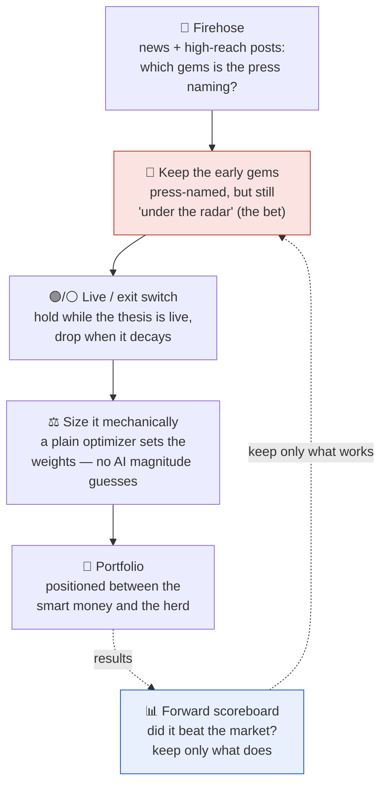

# geo-herd-rider

**Author:** Joe Hahn  
**Email:** jmh.datasciences@gmail.com  
**Date:** 2026-Jun-20 <br>
**branch:** main

**Our model of the market.** Two groups move a price. The **smart money** (insiders and genuinely expert investors) have a real edge, they get to move first and they reap the greatest rewards. Then the **slow herd** arrives late to pile in and flatten the opportunity. We are neither. We have no inside information and no deep-investor edge, but we do have **data** (news, posts, reports, prediction markets) and **AI to manage that data**. Our play is to use that data's leading indicators to infer *where the smart money is already heading* and position us **between the smart money and the herd**; late enough such that the direction is discernable  and early enough to capture some of the move before the herd arrives and prices it away. And just as we ride in ahead of the herd, we ride out as it shows up: once the herd has piled in and flattened the opportunity that position has done its work, so we pivot off to the next event whose opportunity is still un-grazed.

**Where the edge actually was.** The original plan was grander: have an AI ladder out the whole *tree* of downstream implications behind each event and bet the non-obvious "middle band." Building it taught us something simpler and sharper — **we don't need to reconstruct the causal chain, because the financial press already publishes the answer, by ticker.** The move that motivated this project, **BWET**, was named in print as a standout trade *weeks before it tripled* (MarketBeat, Feb 16 2026; etf.com, Mar 4: *"the best-performing ETF of 2026 … has largely flown under the radar"*). We were never going to out-reason that — we just had to be **reading**. So geo-herd-rider now leans on the **firehose**: monitor the news for the few articles that call out a hidden gem *by name*, ride it while its driving thesis is live, and exit before the crest when the thesis decays. The "between smart money and herd" window is exactly the gem the press has *named* (smart money already in) but still frames as *under the radar* (the herd hasn't piled in yet). We never predict *how big* a move will be — only which ticker, and whether its thesis still holds; sizing is left to a mechanical optimizer downstream.

**What this repo does.** Each week it reads the news firehose (plus high-reach posts), has an LLM extract the tickers the press explicitly names as thesis-driven movers, and curates a watchlist; a plain mean-variance optimizer then weights it. A position is **held while its driving catalyst is live** and **dropped when the thesis decays** (ceasefire signed, chokepoint reopens). The LLM picks the names and the live/exit switch — never magnitude. Look-ahead hygiene runs throughout, and because no search tool offers true point-in-time retrieval, **the only clean verdict is forward** (a live paper trade), with historical backtests treated strictly as upper bounds.

## How it works, at a glance

The machine is one short assembly line. We **read the firehose** for the gems the press is already calling out; we **keep the ones still framed as early** (named, but under-the-radar — the actual bet); a position **rides while its thesis is live and exits when it decays**; and a **plain optimizer**, never the AI, sets the sizes. The result is a book positioned *between* the smart money and the slow herd. A **forward scoreboard** sits over the whole thing — the only contamination-free test — and keeps only what actually beats the market.



The two highlighted boxes are what makes this different from a momentum screener: the **early gem** (red) is *where* the edge lives — the press has named it but the herd hasn't arrived — and the **forward scoreboard** (blue) is the referee that keeps the whole thing honest.

## The firehose: why reading beats reasoning

We are not screening all tickers to discover gems, and we no longer try to *derive* them from a causal tree. The financial press does the gem-discovery and prints the ticker — repeatedly, and progressively earlier as a move builds. BWET, in the 2026 Trump–Iran war:

| Date | Outlet | Framing | from this date → peak |
|---|---|---|---|
| **Mar 4** | etf.com | *"best-performing ETF of 2026 … flown under the radar"* | **~3.2×** |
| Mar 20 | ETF.com | *"skyrocketing … still flying under the radar"* | ~2.3× |
| Apr 9 | Business Times | *"a 1,300% rally … an Iran war gauge"* | ~1.5× |
| Apr 25 | CNBC | *"up over 600% … better than oil or energy stocks"* | mainstream |

The **framing is the entry signal**: *"under the radar / no one's talking about it"* is the press telling you the trade is still early (room to run); *"everyone's piling in"* is the press telling you it's late. So we keep the gems the press names *while still framed early*, and we **exit on thesis decay** — the question "when do we drop BWET?" answers itself: when the catalyst resolves (the Strait of Hormuz reopens, a ceasefire is signed) and freight rates roll over.

The canonical chain that put BWET in the press: **aircraft carriers steam to the western Mediterranean _(Feb 2026)_ → the market reads a rising risk that the Strait of Hormuz is choked → tanker rates spike → a tiny tanker-freight ETF becomes the cleanest expression of the whole war.** We don't have to ladder that chain ourselves — a journalist already did, and named the fund.

The ticker that motivated this project is **BWET**. In the 2026 Trump–Iran war it ran **~8x** from its spark — Iran's late-December 2025 currency collapse and mass protests, which drew Trump's "armada" toward the Gulf — to its May peak, while SPY sat flat (and ~5x of that came after the February carrier move alone). The edge isn't knowing BWET will run 8x — it's *reading the article that names it* early enough to ride the back half (still ~3x from the first "under the radar" write-up). The May plateau is the three-tier model in one line: as the press turned toward peace, smart money rotated out while the slow herd kept backfilling.


A year of context, indexed to 100 at the Feb-2026 carrier deployment (SPY in grey). BWET drifted at a fraction of its eventual level all year, then ran with the war. Reproduce: `python scripts/plot_shipping.py`.

**Live dashboard:** [a $50K book traded through the solution](https://joehahn.github.io/geo-herd-rider/) — portfolio value vs SPY, allocation over time, a [firehose log](https://joehahn.github.io/geo-herd-rider/firehose.html) of the week-by-week press-named gems, and an LLM-cost panel. The on-screen book is the **fixture** backtest: it assumes perfect point-in-time retrieval of the early articles (which no search tool actually delivers), so it proves the *mechanics* — not that the firehose finds the gems in time. A **hindsight-contaminated upper bound**; rebuild with `python scripts/build_dashboard.py`.

## The signal, and its jobs

One source, three jobs — plus mechanical sizing:

- **Read** — *what's worth owning.* The news firehose (and high-reach posts via `trump_feed.py`, point-in-time-sliceable) — the tickers the press explicitly **names** as thesis-driven movers. The human never picks.
- **Enter** — *is it still early?* Keep a named gem while the press frames it as early / under-the-radar (smart money in, herd not yet). The framing is the entry filter.
- **Exit** — *is the thesis still live?* Hold while the driving catalyst is active; drop it when the press says it's resolving (ceasefire, chokepoint reopens, rates rolling over).
- **Sizing** — mechanical. A standard mean-variance optimizer weights whatever watchlist results, tuned only by `investor_profile.md`. The LLM never touches the numbers.

The machine, end to end: *firehose → name the early gem → live/exit switch → mechanical sizing → a forward scoreboard that keeps the whole thing honest.*

## Status

The firehose pipeline is built end-to-end and the **mechanics are proven**; the **forward eval** is the pending clean verdict.

**Pipeline.** `firehose.py` reads the firehose each week (news search + `trump_feed.py` posts), extracts the press-named gems with a thesis + live/exit switch + crowding tag, and hands the live watchlist to the reused mean-variance optimizer (`curator._optimized_weights` + `investor_profile.md`). `firehose.py --fixture` runs the look-ahead-clean *mechanics* test against a fixed article set; `forward.py --scan/--report` runs the live, contamination-free forward eval. Every LLM call is priced into `data/llm_costs.csv`; the book renders at the [live dashboard](https://joehahn.github.io/geo-herd-rider/).

**Mechanics result (2026 Iran war, fixture / perfect-retrieval).** Given the real early articles, the firehose enters BWET on its first under-the-radar write-up and rides it while the Iran/Hormuz thesis is live: dashboard **$50K → ~$157K (≈ +210%) vs SPY ≈ +9%**, BWET held ~16 weeks. This assumes perfect retrieval (it isn't achievable retrospectively), so it is an **upper bound on the mechanics, not forward lift**.

**The look-ahead reality.** No available search tool gives true point-in-time retrieval — both Anthropic's `before:` and Tavily's `end_date` leak post-cutoff articles, and the early "under-the-radar" pieces don't rank into a date-bounded pull (`src/search.py` enforces a hard client-side date bound, and even then they're missed). Combined with a curator model trained past the events, this makes a clean *retrospective* test impossible. **The firehose is provable only forward**, where "search now for a just-happened gem" is look-ahead-correct by construction.

**Next.** Accrue forward trades (`forward.py --scan` weekly, `--report`); then layer in more firehose sources (Fed, Musk, Dimon, congressional trades) one forward-scoreboard-gated step at a time. The earlier decision-tree architecture (causal-ladder curator + central-development synthesis) has been **retired** in favor of the firehose.

## Setup

```bash
git clone <this repo>
cd geo-herd-rider
python3.12 -m venv .venv
source .venv/bin/activate
pip install -r requirements.txt

# The LLM curator calls the Anthropic API — bring your own key.
cp .env.example .env        # then edit .env, or just export the var:
export ANTHROPIC_API_KEY=sk-ant-...
# optional: OPENROUTER_API_KEY (cheap models), TAVILY_API_KEY (look-ahead-safe news search)
```

`.env` is gitignored, so your key is never committed.

## Run it

**Mechanics test (fixture — look-ahead-clean, assumes perfect retrieval):**

```bash
# Each weekly scan sees only fixture articles published by then; rides BWET while its thesis is live.
python src/firehose.py --fixture data/fixtures/firehose_bwet.json --start 2026-02-06 --end 2026-06-18

# Rebuild the $50K dashboard from the saved scan log (no LLM cost):
python scripts/build_dashboard.py
```

**Forward eval (the clean verdict — run weekly from today):**

```bash
python src/forward.py --scan      # live firehose scan for this week, appended to the forward log
python src/forward.py --report    # mark the accumulated book to market vs SPY
```

`--scan` searches the live news now (look-ahead-correct by construction) and logs each week's
press-named gems with `decision_ts=now`; lift accrues over weeks as positions mature.

## Notes

Developed with [Claude Code](https://claude.com/claude-code). See [`CLAUDE.md`](CLAUDE.md) for the rules Claude follows in this repo, [`SPEC.md`](SPEC.md) for the pre-registered design and the baby-step plan, [`TODO.md`](TODO.md) for backlog ideas not yet scoped, and [`prior-work/`](prior-work/) for the earlier experiments this design builds on.

## Disclaimer

Technical demo. Not financial advice. Historical performance is not predictive. Do not trade real money on this output.

## License

MIT.
