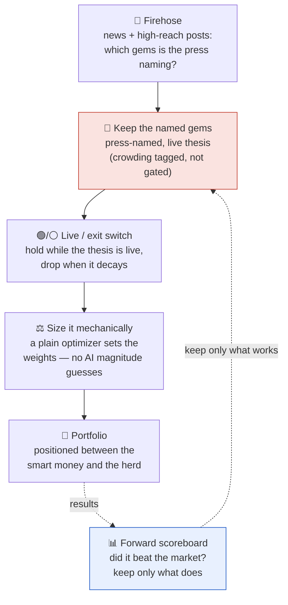

# geo-herd-rider

**Author:** Joe Hahn  
**Email:** jmh.datasciences@gmail.com  
**Date:** 2026-Jun-21 <br>
**branch:** main

**Our model of the market.** Two groups move a price. The **smart money** (insiders and genuinely expert investors) have a real edge, they get to move first and they reap the greatest rewards. Then the **slow herd** arrives late to pile in and flatten the opportunity. We are neither. We have no inside information and no deep-investor edge, but we do have **data** (news, posts, reports, prediction markets) and **AI to manage that data**. Our play is to use that data's leading indicators to infer *where the smart money is already heading* and position us **between the smart money and the herd**; late enough such that the direction is discernable and early enough to capture some of the move before the herd arrives and prices it away. And just as we ride in ahead of the herd, we ride out as it shows up: once the herd has piled in and flattened the opportunity that position has done its work, so we pivot off to the next event whose opportunity is still un-grazed.

**The core idea.** We don't reason out a causal chain to *find* the next winner — the financial press already publishes the answer, by ticker, and it does so repeatedly and progressively earlier as a move builds. A niche tanker-freight ETF (BWET) was named in print as a standout trade — *"the best-performing ETF of 2026 … flown under the radar"* — weeks before it tripled again. The edge is simply to be **reading**: enter when the press names a ticker on a *live* thesis, ride while that thesis holds, and exit when it decays. We *also* tag how crowded each gem's coverage is — still *under the radar* vs *everyone's piling in* — a read on where it sits between the smart money (already in the named gem) and the slow herd (not yet). That crowding tag is currently a **diagnostic, not an entry gate** (see Status). We never predict *how big* a move will be — only which ticker, and whether its thesis still holds; a mechanical optimizer sizes it.

**What this repo does.** Each week an LLM reads the news firehose (plus high-reach posts), extracts the US-listed tickers the press explicitly **names** as thesis-driven movers, and curates a watchlist; a plain mean-variance optimizer then weights it. A position is **held while its driving catalyst is live** and **dropped when the thesis decays** (ceasefire signed, chokepoint reopens). Look-ahead hygiene runs throughout, and because no search tool offers true point-in-time retrieval, **the only clean verdict is forward** (a live paper trade) — historical backtests are treated strictly as upper bounds.

## How it works, at a glance

The machine is one short assembly line. We **read the firehose** for the gems the press is already calling out; we **keep the named gems on a live thesis** (tagging how early/crowded each is); a position **rides while its thesis is live and exits when it decays**; and a **plain optimizer**, never the AI, sets the sizes. The result is a book positioned *between* the smart money and the slow herd, and a **forward scoreboard** — the only contamination-free test — keeps only what beats the market.



The two highlighted boxes are what makes this different from a momentum screener: the **named gem on a live thesis** (red) is *where* the edge lives — the press has named it and the catalyst is still running — and the **forward scoreboard** (blue) is the referee that keeps the whole thing honest.

## The firehose: why reading beats reasoning

We don't screen all tickers to discover gems, and we don't derive them from a causal tree. The financial press does the gem-discovery and prints the ticker — repeatedly, and progressively earlier as a move builds. BWET, in the 2026 Trump–Iran war:

| Date | Outlet | Framing | from this date → peak |
|---|---|---|---|
| **Mar 4** | etf.com | *"best-performing ETF of 2026 … flown under the radar"* | **~3.2×** |
| Mar 20 | ETF.com | *"skyrocketing … still flying under the radar"* | ~2.3× |
| Apr 9 | Business Times | *"a 1,300% rally … an Iran war gauge"* | ~1.5× |
| Apr 25 | CNBC | *"up over 600% … better than oil or energy stocks"* | mainstream |

We **tag the framing**: *"under the radar / no one's talking about it"* says the trade is still early (room to run); *"everyone's piling in"* says it's late. We enter the gems the press names on a *live* thesis and **exit on thesis decay** — the question "when do we drop BWET?" answers itself: when the catalyst resolves (the Strait of Hormuz reopens, a ceasefire is signed) and freight rates roll over. Whether to *also* require a gem still be framed "early" at entry is a knob we **test, not assume** (see Status).

The ticker that motivates this project is **BWET**. In the 2026 Trump–Iran war it ran **~8×** from its spark — Iran's late-December 2025 currency collapse and mass protests, which drew Trump's "armada" toward the Gulf — to its May peak, while SPY sat flat. The edge isn't knowing BWET will run 8× — it's *reading the article that names it* early enough to ride the back half (still ~3× from the first "under-the-radar" write-up). The May plateau is the three-tier model in one line: as the press turned toward peace, smart money rotated out while the slow herd kept backfilling.


A year of context, indexed to 100 at the Feb-2026 carrier deployment (SPY in grey). BWET drifted at a fraction of its eventual level all year, then ran with the war. Reproduce: `python scripts/plot_shipping.py`.

**Live dashboard:** [a $50K book traded through the solution](https://joehahn.github.io/geo-herd-rider/) — portfolio value vs SPY, allocation over time, a [firehose log](https://joehahn.github.io/geo-herd-rider/firehose.html) of the week-by-week press-named gems, and an LLM-cost panel. The on-screen book is a **fixture** backtest that assumes perfect point-in-time retrieval of the early articles (which no search tool actually delivers), so it proves the *mechanics* — not that the firehose finds the gems in time. A **hindsight upper bound**; rebuild with `python scripts/build_dashboard.py`.

## The signal, and its jobs

One source, three jobs — plus mechanical sizing:

- **Read** — *what's worth owning.* The news firehose (and high-reach posts via `trump_feed.py`, point-in-time-sliceable) — the tickers the press explicitly **names** as thesis-driven movers. The human never picks.
- **Enter** — *the press names it on a live thesis.* We also tag how crowded the coverage is (early → consensus) as a read on smart-money-vs-herd positioning — a **diagnostic today, not an entry gate**; whether early-gating earns its keep is tested in the harness.
- **Exit** — *is the thesis still live?* Hold while the driving catalyst is active; drop it when the press says it's resolving. Mainstream hype ("up 600%, everyone piling in") is *crowding*, not thesis death — only the catalyst resolving is.
- **Sizing** — mechanical. A standard mean-variance optimizer weights whatever watchlist results, tuned only by `investor_profile.md`. The LLM never touches the numbers.

Cadence is **one knob** (`rebalance_days`, default 7 = weekly): it sets both how often the firehose re-scans/re-optimizes *and* the trailing news window each scan reads — they're the same thing ("the news since the last scan"). A position persists across scans via a sticky hold (it exits on confirmed thesis death or prolonged silence), so coverage gaps don't churn it.

Scope is **US-listed instruments, including ADRs and country/theme ETFs** — so a foreign event (a war, an election) is captured via its US-listed proxy (e.g. YPF / ARGT for Argentina), which is both how the US press names it and what a retail brokerage can trade.

## Harvesting the distribution, not one gem

Event-driven runs are heavy-tailed: BWET is a tail outlier, and below it sit progressively more numerous, smaller analogs. So the objective is to **harvest the distribution** — reliably ride the many medium-tier events — not to time one jackpot. The system is therefore measured against a locked multi-event test set (`data/fixtures/gems.json`, window 2022-09 → present, US-listed incl. ADRs/ETFs), balanced across **verticals** (AI, nuclear, crypto, healthcare, defense, shipping, EM-energy, materials, consumer, precious-metals) and **geopolitical types** (war ×2, election, trade-war):

> CVNA ~100× · PLTR 32× · NVDA 17× · SMR 16× · SMCI 14×↘ · MSTR 13× · HIMS 11× · RNMBY 8× · BWET ~8× · MP 6.5× · YPF 4.4× · GDX 3.5× · URA 3.2× — plus PTON (a slow-fizzle *negative control* for the exit engine).

This measures **recall** (how many gems the firehose catches) and the **exit engine** (does it cut a decaying thesis); **precision** (false positives — does it also grab hyped names that fizzle?) is measured separately by the realistic GDELT-noise run.

## Status

The firehose pipeline is built end-to-end; the **forward eval** is the pending clean verdict.

**Pipeline.** `firehose.py` reads the firehose each week (news + `trump_feed.py` posts), extracts press-named gems with a thesis + live/exit switch + crowding tag, and hands the live watchlist to the reused mean-variance optimizer (`investor_profile.md` knobs). Every LLM call is priced into `data/llm_costs.csv`; the book renders at the [live dashboard](https://joehahn.github.io/geo-herd-rider/).

**Three eval surfaces.**
- `firehose.py --fixture` — a look-ahead-clean **mechanics** test against a fixed article set (perfect-retrieval assumption): given the early articles, the engine enters BWET on its first under-the-radar write-up and rides it while the Iran/Hormuz thesis is live (dashboard ~+220% vs SPY ~+9%). An upper bound on the mechanics, not lift.
- `firehose.py --gdelt --seed <file>` — a **realistic** backtest: real date-honored GDELT headlines per week (`src/gdelt.py`) + the early niche pieces GDELT misses, seeded at their true dates. The curator must *find* the gem in genuine noise — the fast dev loop for hunting weaknesses (it drove a sticky-hold, selectivity/vehicle-selection, and ticker-validation hardening). Still a hindsight upper bound.
- `forward.py --scan/--report` — the **live, contamination-free** forward eval: scan the firehose now (look-ahead-correct by construction), log each week's picks, mark to market as prices arrive.

**The look-ahead reality.** No search tool gives true point-in-time retrieval — Anthropic's `before:` and Tavily's `end_date` leak post-cutoff articles, and the early "under-the-radar" pieces don't rank into a date-bounded pull (`src/search.py` enforces a hard client-side date bound, and even then they're missed). **GDELT** (`src/gdelt.py`) *does* honor dates, but under-indexes niche trade press, so it picks a gem up only once mainstream piles in (late). Combined with a curator model trained past the events, this makes a clean *retrospective* test impossible. **The firehose is provable only forward**, where "search now for a just-happened gem" is look-ahead-correct.

**An open knob, tracked not assumed.** Today entry fires on *press-named + live thesis*; the `crowding` tag (early → crested) is recorded but **does not gate entry or exit**. Whether *requiring a gem still be framed "early" at entry* actually improves returns — vs. missing gems we only discover already-mainstream — is a variable the multi-event harness will test, not something we bake in on faith.

**Next.** Build the multi-event harness on the locked gem set (recall / precision / tail-capture, and the early-entry-gating knob above); in parallel accrue forward trades (`forward.py --scan` weekly); then add firehose sources (Fed, Musk, Dimon, congressional trades) one forward-scoreboard-gated step at a time.

## Setup

```bash
git clone <this repo>
cd geo-herd-rider
python3.12 -m venv .venv
source .venv/bin/activate
pip install -r requirements.txt

# The LLM curator calls the Anthropic API — bring your own key.
cp .env.example .env        # then edit .env, or just export the var:
export ANTHROPIC_API_KEY=sk-ant-...
# optional: OPENROUTER_API_KEY (cheap models), TAVILY_API_KEY (look-ahead-safe news search)
```

`.env` is gitignored, so your key is never committed.

## Run it

**Mechanics test (fixture — look-ahead-clean, assumes perfect retrieval):**

```bash
python src/firehose.py --fixture data/fixtures/firehose_bwet.json --start 2026-02-06 --end 2026-06-18
python scripts/build_dashboard.py          # rebuild the $50K dashboard (no LLM cost)
```

**Realistic backtest harness (real GDELT firehose + seeded early gems — the fast dev loop):**

```bash
# Real date-honored GDELT headlines per week + the early niche pieces GDELT misses, seeded at
# their true dates. The curator must FIND the gem in the noise. GDELT pool is cached after the
# first (throttled) fetch. Still a hindsight upper bound — the verdict is the forward eval.
python src/firehose.py --gdelt --seed data/fixtures/firehose_bwet.json \
    --start 2026-02-06 --end 2026-06-18
```

**Forward eval (the clean verdict — run weekly from today):**

```bash
python src/forward.py --scan      # live firehose scan for this week, appended to the forward log
python src/forward.py --report    # mark the accumulated book to market vs SPY
```

## Notes

Developed with [Claude Code](https://claude.com/claude-code). See [`CLAUDE.md`](CLAUDE.md) for the rules Claude follows in this repo, [`SPEC.md`](SPEC.md) for the pre-registered design, [`TODO.md`](TODO.md) for backlog, and [`prior-work/`](prior-work/) for the earlier experiments this design builds on.

## Disclaimer

Technical demo. Not financial advice. Historical performance is not predictive. Do not trade real money on this output.

## License

MIT.
