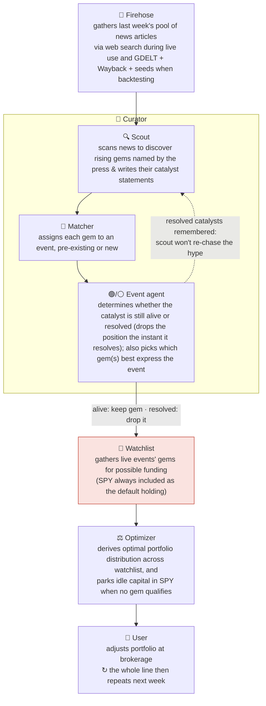

# geo-herd-rider

**Author:** Joe Hahn  
**Email:** jmh.datasciences@gmail.com  
**Date:** 2026-Jun-23 <br>
**branch:** main

**Our model of the market.** Two groups move a price. The **smart money** (insiders and genuinely expert investors) have a real edge, they get to move first and they reap the greatest rewards. Then the **slow herd** arrives late to pile in and flatten the opportunity. We are neither. We have no inside information and no deep-investor edge, but we do have **data** (news, posts, reports, prediction markets) and **AI to manage and interpret that data**. Our play is to use that data's leading indicators to infer *where the smart money is already heading* and position us **between the smart money and the herd**; late enough such that the direction is discernable and early enough to capture some of the move before the herd arrives and prices it away. And just as we ride in ahead of the herd, we ride out as it shows up: once the herd has piled in and flattened the opportunity that position has done its work, so we pivot off to the next event whose opportunity is still un-grazed.

**The core idea.** We don't reason out a causal chain to *find* the next winner — the financial press already publishes the answer, by ticker, naming the winner **early** (while it's still under the radar) and then repeatedly, more loudly, as the move builds. For example, the niche tanker-freight ETF (BWET) was named in print as a standout trade — *"the best-performing ETF of 2026 … flown under the radar"* — weeks before it tripled again. Our edge is simply to be **reading**: enter when the press names a ticker on a *live* thesis — a *thesis* being the specific catalyst driving the ticker (here, a war spiking tanker freight rates), *live* while that catalyst is unresolved — ride while the thesis holds, and exit when the catalyst resolves. AI is never used to predict *how big* a move will be — only which ticker or tickers to monitor, and whether its thesis still holds, while a non-AI mechanical optimizer sizes it.

**What this repo does.** Walking week by week, an LLM reads the news firehose, extracts the US-listed tickers the press explicitly **names** as thesis-driven movers, and curates a watchlist. A standard portfolio optimizer then decides **how much to hold of each name** — sizing them from their recent returns and volatility (using the same math that robo-advisors utilize). A position is **held while its driving catalyst is live** and **dropped when the driver behind the rise goes away** (ceasefire signed, chokepoint reopens). This whole solution is then backtested against a curated set of about a dozen historical thesis-driven events and the tickers (designated as **gems**) that they drove.

## How it works, at a glance

This solution is one short assembly line that loops once a week. It reads the news firehose to spot the **events** the press is flagging. Each event is driven by a **catalyst** — a discrete cause such as a war, an election, or a supply shock — and that catalyst causes specific tickers (which we designate as **gems** which are named explicitly by the journalists covering the event) to rise. A gem's **thesis** is just *why* it's rising — the claim that this catalyst is driving this ticker. A **scout** discovers the events; a **matcher** groups each week's named tickers into the events already in flight; and then an **event agent** **tracks each event over time** — an event can last weeks, months, or years, and the gem that best expresses it can *change* as it unfolds. We invest in a gem while its thesis is **live** (the catalyst still active/unresolved) and **exit** (drop the position) when the catalyst **resolves** (the war ends, the chokepoint reopens, the bill is signed). A **plain optimizer** (never the AI) then sizes whatever is held.



The whole assembly line **runs once per `rebalance_days` (default 7 = weekly)** and marches week by week across the era. Each pass re-reads the firehose, the event agents re-ask *"is this event's thesis still live, or has it resolved?"*, each agent then names the gem or gems that best express the event it is monitoring (and those gems can change over time), and then the optimizer rebalances the portfolio — **sizing is mechanical; the AI never sets the position sizes** (it only names tickers and the hold/exit call). An event isn't rediscovered from scratch each week: its agent remembers what it concluded last week (its prior-week note), and the position stays on (a "sticky hold") through quiet weeks — so each event is tracked continuously until its agent calls the exit. The exit is **resolution-driven, not crowd-driven** (we drop on the catalyst *resolving* — war ends, bill passes). Each week the agent argues the devil's-advocate case that the catalyst has *already happened* and then answers a forced binary — *has the catalyst resolved, yes or no?* — and a yes drops the position **immediately** (a resolved catalyst is definitive, so it exits at once rather than waiting out the sticky-hold), even if the coverage is still loud. And once a catalyst resolves it is **remembered**: the scout is told which catalysts have already resolved (over the last `curator_memory_weeks`, default 8) so it won't **re-open the same ticker on lingering hype** after the catalyst is done (a ceasefire already signed isn't a fresh catalyst).

The red highlighted box is where our advantage comes from: the press has already flagged a live catalyst (the **event**) and named the tickers that express it (its **gem(s)**), so we never have to predict the winner ourselves — this solution just reads the ticker named by the press and rides it while its thesis holds.

The sections below explain each box in greater detail — the [Firehose](#the-news-firehose-why-reading-beats-reasoning), the [Curator](#inside-the-curator-scout--event-agents) (its scout, matcher, event agents), and the [watchlist and optimizer](#the-signal-and-its-jobs).

## The news firehose: why reading beats reasoning

This solution doesn't screen all tickers to discover gems. The financial press already does that work and names the ticker, repeatedly, early while it's under the radar and then louder as the move builds. Here is BWET's news-history during the runup to the 2026 Iran war:

| Date | Outlet | Framing | from this date → peak |
|---|---|---|---|
| **Mar 4** | etf.com | *"best-performing ETF of 2026 … flown under the radar"* | **~3.2×** |
| Mar 20 | ETF.com | *"skyrocketing … still flying under the radar"* | ~2.3× |
| Apr 9 | Business Times | *"a 1,300% rally … an Iran war gauge"* | ~1.5× |
| Apr 25 | CNBC | *"up over 600% … better than oil or energy stocks"* | mainstream |

The progression in that last column, from "under the radar" to "everyone piling in", traces a gem moving from the smart money to the slow herd, and reading it early is the whole point. This solution enters the gems the press names on a live thesis and exits on thesis decay. The question "when to drop BWET?" answers itself: the position is dropped when the catalyst resolves (the Strait of Hormuz reopens, a ceasefire is signed) and freight rates roll over, not when the coverage merely gets crowded.

**Where the news comes from.** The firehose has two modes, and they must use different news sources, because reading historical news is a fundamentally different problem from reading this week's:

- **Live use (running the solution going forward, week to week).** The firehose is Anthropic web search, not a bulk download of every article published that week. Instead the curator answers a single question, *which tickers is the press naming as thesis-driven movers this week?*, by running its own web searches for exactly that, reading the headline and snippet of each result, and returning the tickers the press flags. From that one question Claude spawns its own follow-up searches (no fixed list; it adapts to whatever's live that week), capping every search to news dated today or earlier.

- **Backtest (replaying history to score this solution).** Here a normal web search is poison: searching old news today silently re-imports the future. Its date filters leak post-cutoff articles, its results are ranked by what later became famous, and it returns today's edited page. The goal is to assemble a representative news pool that is neither poisoned (no look-ahead) nor incomplete (it must include the early, under-the-radar phase, where the edge lives). That is why this solution uses GDELT, Wayback, and seeds:
  - **GDELT** is the only date-honest discovery index: it has server-enforced date bounds, and results ordered by date rather than relevance, so a gem's early article isn't boosted because it later mooned. GDELT is queried with a fixed list of 23 beats (superlatives, macro beats, the GICS sector sweep, and a small thesis-driven theme layer), never a ticker symbol:
    ```
    superlatives:  "best performing stock"  "biggest gainers"  "best performing etf"
    macro beats:   geopolitics  war  shipping  tariffs  "interest rates"
    sectors:       "technology stocks"  "energy stocks"  "financial stocks"
                   "healthcare stocks"  "industrial stocks"  "materials stocks"
                   "consumer stocks"  "utility stocks"  "real estate stocks"
                   "telecom stocks"
    themes:        cryptocurrency  "space stocks"  "robotics stocks"
                   "quantum stocks"  "nuclear stocks"
    ```
    The first three groups are gem-agnostic by construction, while the 10-beat sector sweep is derived from the 11 GICS sectors but with consumer staples and discretionary merged into a single consumer search term, plus market-wide superlatives, so that nothing is privileged. The themes group covers non-GICS asset classes and emerging-tech areas where gems emerge but the sector sweep is too coarse (quantum) or doesn't reach at all (crypto).
  - **But GDELT catches a gem late, not early.** It monitors a mostly-mainstream source list and surfaces a story only once it has propagated across those outlets, so the niche, low-readership early write-ups (the "(BWET) … under the radar" pieces) are under-indexed or absent, and a gem usually enters GDELT only after it has gone mainstream. GDELT also returns headlines only, and a headline names the theme, rarely the ticker.
  - So **Wayback** is used to patch the headline gap: for each URL GDELT did return, it fetches that page's as-of-date archived lede (which usually names the ticker). But it can't conjure URLs GDELT never returned, so GDELT plus Wayback is itself incomplete and largely misses the early trajectory.
  - **Seeds** fill exactly that hole: a handful of real early articles, harvested from each gem's under-the-radar phase and injected at their true publish dates. Because they are genuine, date-stamped news, the curator sees them only on or after the day they actually appeared, which fixes the incompleteness with no look-ahead poison. (Honest caveat: the seeds are harvested knowing which gems won, so any returns inferred from these seeded backtests should be treated as an upper limit; the seeds grant the early naming rather than proving the solution would have retrieved it.)

  **Why the forward-looking live use does not utilize GDELT + Wayback + seeds:** during live use, the firehose is Anthropic web search, which rides a general-purpose web index. It is far broader than GDELT's news monitors (it reaches the niche trade press), it returns the content snippet rather than just the headline, and it indexes fresh pages within days. So a just-published under-the-radar write-up is reachable as it appears, before it goes mainstream, with no seeding needed.

The ticker that motivates this project is **BWET**. In the 2026 Iran war it ran ~8× from its spark (Iran's late-December 2025 currency collapse and mass protests, which drew Trump's "armada" toward the Gulf) to its May peak, while SPY sat flat. The edge isn't knowing BWET will run 8×, it's reading the article that names it early enough to ride the back half (still ~3× from the first "under-the-radar" write-up). The May plateau is the three-tier model in one line: as the press turned toward peace, smart money rotated out while the slow herd kept backfilling.


## Live dashboard

[**A landing page of per-gem scans**](https://joehahn.github.io/geo-herd-rider/) — one dashboard per hidden-gem event ([BWET](https://joehahn.github.io/geo-herd-rider/bwet/), [MP](https://joehahn.github.io/geo-herd-rider/mp/), …), each showing value vs SPY, allocation over time, cumulative $-gain per holding, the **event agent-journal arc** (week-by-week hindsight / read / exit-state, for spotting anchoring or missed exits), a firehose log, retrieval-health, the curator **model** used, and an LLM-cost panel. Each portfolio is the **event-first agent** finding that gem in a **realistic, noisy GDELT news firehose**, with **Wayback** recovering the as-of-date ticker-naming ledes GDELT's headlines omit (look-ahead-clean) and the niche early pieces GDELT never indexes **seeded** at their true dates (the one retrieval shortcut; see Status). Each is a **hindsight upper bound** (seeded early naming + a model trained past the events), not a promise — the ceiling the mechanics can reach on clean inputs. A [**parameter-sweep dashboard**](https://joehahn.github.io/geo-herd-rider/sweeps/) leads with a **6-model LLM bake-off** (sum Final Curated value per curator model, ordered by cost) and then plots the sum (across all gems) of Final Curated Portfolio value vs sizing knobs (`concentration_cap`, `lookback_period_days`, `min_trade_size`, `risk_aversion`) against the flat Sum-SPY benchmark. Rebuild all with `python scripts/build_dashboard.py --all`.

## The signal, and its jobs

One source, three jobs — plus mechanical sizing:

- **Read** — *what's worth owning.* The news firehose — the tickers the press explicitly **names** as thesis-driven movers. The human never picks. (High-reach posts via `trump_feed.py` are a *roadmapped* second source — point-in-time-sliceable and wired into the legacy single-scan path, but not yet read by the event-first engine.)
- **Enter** — *the press names it on a live thesis.* The human never sets the trade; the curator just reports which tickers the press is naming as live movers.
- **Exit** — *is the thesis still live?* Hold while the driving catalyst is active; drop it when the press says it's resolving. Mainstream hype ("up 600%, everyone piling in") is **not thesis death** — only the catalyst resolving ends the hold.
- **Sizing** — mechanical (the ⚖️ **Optimizer** box). A standard mean-variance optimizer weights whatever watchlist results, tuned only by `investor_profile.md` — including a per-week **position cap** (`max_concurrent_positions`, funds only the top-N by weight) and an always-available **SPY** default (`hold_benchmark`), so a gem must beat SPY to be funded and idle capital rides the market instead of sitting in cash. The LLM never touches the numbers, and a schema guardrail (below) drops any magnitude it tries to emit.

Cadence is **one knob** (`rebalance_days`, default 7 = weekly): it sets both how often the firehose re-scans/re-optimizes *and* the trailing news window each scan reads — they're the same thing ("the news since the last scan"). A position persists across scans via a [sticky hold](agent_design.md#sticky-hold-hysteresis-current) (it exits on confirmed thesis death or prolonged silence), so coverage gaps don't churn it.

Scope is **US-listed stocks, ADRs, ETFs and ETNs** (e.g. BWET is an ETN) — so a foreign event (a war, an election) is captured via its US-listed proxy (e.g. YPF / ARGT for Argentina), which is both how the US press names it and what a retail brokerage can trade. A **code guard** drops any candidate with a foreign-exchange suffix (`CSL.AX`, `7203.T`, …) — the scout must name the US ADR or skip — so a foreign listing can't slip into the book. **Options and futures are excluded on principle**: they'd require a strike / expiry / leverage call (i.e. *magnitude*), which the mechanical optimizer can't size and the no-magnitude guardrail forbids — commodity and rate exposure comes via ETFs/ETNs instead. (Admissibility rule in [`agent_design.md`](agent_design.md).)

## Inside the curator: scout → event agents

**Each week the engine discovers, then fans out.** Discovery poses a single question to the firehose — *which tickers is the press naming as thesis-driven movers this week?* — and surfaces a few candidate events (a scout call reads the whole week's coverage; you can't target-search an event you haven't found yet, so discovery must be broad). The engine then **fans out one agent per live event** — the new candidates plus every event already being held — each running in parallel: it pulls *its own* event's news, reads its full journal arc since entry, writes a hindsight self-critique, and makes the hold-or-exit call. The live events' current tickers become the watchlist the optimizer sizes. Next week, repeat.

The curator runs in one of two modes, both feeding the same optimizer — the two leftmost paths in the diagram:

- **Single scan** (the baseline) — one LLM call per week reads the whole firehose and emits the watchlist. Simple and cheap, but it tends to *tunnel on the loudest gem* and grab thematic noise.
- **Scout → event agents** (the current engine) — a **scout** reads the firehose to *discover* candidate events; then every held event gets **its own agent** that, each week:
  1. pulls news **targeted to that event** (its own catalyst — including resolution signals like a ceasefire);
  2. reads its **full journal arc since entry** (the catalyst it entered on, the vehicle's evolution, every prior read) and writes a weekly **`hindsight`** self-critique of last week's call *before* deciding — a Reflexion-style step to break repeat-the-same-mistake inertia;
  3. runs an explicit **exit-on-resolution** check against the whole arc — flip to exit the week the specific catalyst *resolves* (bill signed, approval granted, deal closed, chokepoint reopens), even if the stock is still rising and a broader theme lingers (crowding alone is never an exit);
  4. writes a new note: a short assessment, the **`thesis_live` / exit** call (the *only* thing that drives the hold/exit), and hot-linked sources.

  The live events become the watchlist; the optimizer sizes. The journal (`data/windows/agent_journals.json`) is the human-readable audit trail. Discovery is aggregate (you can't target-search an event you haven't found); only *monitoring* a held event uses its own targeted search — so it doesn't bias what we discover.

  *Implementation note — two agent engines:* **`--agent`** is ticker-keyed (the original: one journal per ticker); **`--event-first`** makes the **event** first-class (`agent.run_event_agent_scans`) — an LLM **matcher** groups this week's tickers into existing events (so RNMBY/RHMTY/LMT collapse into *one* defense event), and the event agent holds the **purest current vehicle**, which can *evolve* week to week. The ticker-keyed engine stays as the A/B baseline. The 13-gem run showed why this matters — it fragmented single events across many tickers (RNMBY and RHMTY are the same company under two ADRs); event-first is the fix. See [`agent_design.md`](agent_design.md).

**Guardrail, machine-enforced.** This isn't a polite instruction the model could ignore — it's structural. Every LLM stage must return JSON matching a fixed Pydantic schema (`SCOUT_SCHEMA`, `EVENT_AGENT_SCHEMA`) whose fields are only `ticker`, `thesis`, `thesis_live`, `catalyst_resolved`, and the like — there is **no field for a price target, magnitude, weight, or position size**. The schema is set `extra='ignore'`, so if the model volunteers a number anyway ("buy 8% of BWET"), that field is *silently dropped* before anything downstream sees it. The LLM therefore *cannot* size even if it tries — it has nowhere to put a number; the mechanical optimizer sets every weight. The LLM picks composition and the *when-to-exit* call only. (It may *attribute* a figure to the press — "press cites ~600% YTD" — but never forecasts its own.)

## Models — one seam, pick by need

Every LLM call routes through a provider-agnostic seam (`src/llm.py`), so the same pipeline runs on Anthropic (Opus/Sonnet/Haiku) or any OpenRouter model via the **`model:` knob in `investor_profile.md`** (`optimizer.resolve_curator_model` maps `mimo|sonnet|sonnet5|opus|llama4|deepseek|grok4` → provider + id), with structured-output JSON schemas keeping cheap models' output clean. Each scan stamps a `<scan>.meta.json` sidecar so every dashboard shows *which* model produced that book. A **7-model bake-off** (top plot on the sweeps page) re-scans each model's 3 gems under the current prompts and re-scores them on shared price panels. The current read: **sonnet-4.6 is the best curator**, and its edge is **selectivity** — naming *few, high-conviction* events — not raw catch-rate. The cheap open-weights (Llama-4, MiMo, DeepSeek, ~$0.1–0.4 per 3-gem scan) tend to **sprawl**, naming many events and funding the losers, so *catching* a gem doesn't mean *profiting* from it (Llama-4 caught all three gems yet lost money). So here **capability, not cost, is the differentiator** — and "newer/stronger" isn't automatically better (Sonnet 5 is faster and cheaper but exits winners too early under these prompts). One caveat: the ranking is **sensitive to the optimizer config** (e.g. the lookback window can flip it), and each model is a single draw, so treat the bake-off as **directional**. The live curator is whatever the **`model:` knob** in `investor_profile.md` is set to (currently Sonnet-4.6). Every call's cost is priced into `data/llm_costs.csv`.

## Harvesting the distribution, not one gem

Event-driven runs are heavy-tailed: BWET is a tail outlier, and below it sit progressively more numerous, smaller analogs. So the objective is to **harvest the distribution** — reliably ride the many medium-tier events — not to time one jackpot. The system is therefore measured against a locked multi-event test set (`data/fixtures/gems.json`, window 2022-09 → present, US-listed incl. ADRs/ETFs), balanced across **verticals** (AI, nuclear, crypto, healthcare, defense, shipping, EM-energy, materials, consumer, precious-metals) and **geopolitical types** (war ×2, election, trade-war):

> CVNA ~100× · PLTR 32× · NVDA 17× · SMR 16× · SMCI 14×↘ · MSTR 13× · HIMS 11× · RNMBY 8× · BWET ~8× · MP 6.5× · YPF 4.4× · GDX 3.5× · URA 3.2× — plus PTON (a slow-fizzle *negative control* for the exit engine).

This measures **recall** (how many gems the firehose catches) and the **exit engine** (does it cut a decaying thesis); **precision** (false positives — does it also grab hyped names that fizzle?) is measured separately by the realistic GDELT-noise run.

## Status

The firehose pipeline is built end-to-end and runs over historical news; below is what it scores so far and how those numbers should be read.

**Pipeline.** `firehose.py` runs the single-scan curator; `agent.py` runs the scout→event-agent curator (the current engine). Both hand the live watchlist to the reused mean-variance optimizer (`investor_profile.md` knobs); `scripts/run_harness.py` scores either against the gem set; the dashboard renders the portfolio. Every LLM call is priced into `data/llm_costs.csv`.

**Results so far.**
- *Single-scan baseline (13 gems, realistic GDELT retrieval):* early-recall **0%**, portfolio **+42% vs SPY +98%** — it catches the right *themes* but late and via the wrong *vehicle* (GGAL not YPF, CCJ not URA), drowned in noise. The honest floor.
- *Retrieval decomposition (seed the early articles):* early-recall jumps **0% → 92%**, portfolio **→ +318%** — proving **retrieval, not reasoning, is the wall** (given the early naming, the engine picks the right ticker and rides it).
- *Per-event (ticker-keyed) agent vs single-scan:* on the BWET window it rode BWET the full 16 weeks (4.13×) with a *resolution-aware* exit — **+189–224%** (Opus/Sonnet/MiMo) vs the single-scan's **+87%**. Across the **13 gems** it generalized — early-recall **85%**, precision **37%** (vs 27%), portfolio **+1344% vs SPY +98%** (a stacked upper bound) — but **fragmented single events across many tickers** (RNMBY/RHMTY are the same company; nuclear split across SMR/OKLO/CCJ/CEG). That motivated the event-first engine.
- *Event-first engine (built, BWET-validated):* makes the **event** first-class (LLM matcher + a deterministic same-ticker guard + evolving vehicles). BWET-era spot-check: the guard collapses BWET to **one** event (was three), and the matcher correctly groups distinct vehicles of one catalyst (LHX + RKLB → a single defense event). Not yet A/B'd on the 13 gems.
- *Model bake-off (3 gems, 6 models, current prompts; top plot on the sweeps dashboard):* with the multi-seed discovery fix **all models catch the gems**; frontier (Opus, Sonnet) score highest, the cheap open-weights (Llama-4, MiMo, DeepSeek) land close behind at ~10–40× lower cost — so cost, not capability, is the main lever. Live default = the `model:` knob (currently Sonnet).

**Two backtest surfaces.**
- `firehose.py --fixture` — a look-ahead-clean **mechanics** test against a fixed article set (perfect-retrieval assumption): given the early articles, the engine enters BWET on its first under-the-radar write-up and rides it while the Iran/Hormuz thesis is live (~+220% vs SPY ~+9%, BWET-only). An upper bound on the mechanics, not lift.
- `firehose.py --gdelt --seed <file>` — a **realistic** backtest: real date-honored GDELT headlines per week (`src/gdelt.py`) + the early niche pieces GDELT misses, seeded at their true dates. The curator must *find* the gem in genuine noise — the fast dev loop for hunting weaknesses (it drove a sticky-hold, selectivity/vehicle-selection, and ticker-validation hardening). **The [live dashboards](#live-dashboard) render this surface with `--enrich` Wayback ledes added** (event-first agent + GDELT/Wayback/seeds, English-filtered), one per gem (BWET, MP, SMR) — each showing the catalyst-gated agent finding its gem in genuine noise, holding while the thesis is live, and exiting when the catalyst resolves. Retrieval is clean now (non-English **0%**). Sizing knobs (`concentration_cap`, `min_trade_size`, `lookback_period_days`, `risk_aversion`) are being settled on the [parameter-sweep dashboard](https://joehahn.github.io/geo-herd-rider/sweeps/); the gem dashboards currently render the sweep-adopted settings (cap 0.3334 · min_trade 0.1 · lookback 7 · risk_aversion 0.25, model Sonnet). Returns are hindsight upper bounds.

**Why every number here is an upper bound.** No search tool gives true point-in-time retrieval — Anthropic's `before:` and Tavily's `end_date` leak post-cutoff articles, and the early "under-the-radar" pieces don't rank into a date-bounded pull (`src/search.py` enforces a hard client-side date bound, and even then they're missed). [**GDELT**](agent_design.md#retrieval-gdelt-and-seeds-current) (`src/gdelt.py`) *does* honor dates, but under-indexes niche trade press, so it picks a gem up only once mainstream piles in (late) — which is why the early pieces are seeded back at their true dates (a backtest shortcut, so seeded numbers are upper bounds). On top of that, the curator model was trained past these events. So every backtest figure above is a **ceiling**, reported as such — never read it as realized lift.

**Backtest roadmap (this README's scope).** We harden the engine on a widening historical slice, one rung at a time:
1. **BWET alone** — lock the mechanics on the single motivating gem (enter early, ride, exit on resolution).
2. **BWET + its two nearest-in-time gems** — confirm the scout/matcher keep separate events separate and the optimizer shares capital sanely across a handful of concurrent events.
3. **The full locked gem set** (`data/fixtures/gems.json`) — recall / precision / tail / exit across all verticals and geopolitical types.

Later phases extend beyond backtesting and are intentionally out of scope for this README; they'll be folded back in once we get there.

## Requirements

- **Python 3.12** with the `requirements.txt` packages (anthropic, openai, yfinance, pandas, numpy, scipy, pyyaml, requests, matplotlib, pydantic).
- **An Anthropic API key** (`ANTHROPIC_API_KEY`) is the only key the default pipeline needs. Running the curator bills your Anthropic account.
- **Optional keys:** `OPENROUTER_API_KEY` (only for the cheap open-weight models: mimo, llama4, deepseek, grok4) and `TAVILY_API_KEY` (date-bounded news search in `src/search.py`).
- **No key needed** for GDELT (the news pool), the Wayback Machine (as-of-date ledes), or yfinance (prices). The fixture/mechanics dashboard (`build_dashboard.py`) makes no LLM calls, so it needs no key at all.

You do **not** need Claude Code to run this. Claude Code is the tool the repo was developed with, not a runtime dependency; the solution calls the Anthropic API directly through the `anthropic` Python SDK (`src/llm.py`).

## Setup

```bash
git clone <this repo>
cd geo-herd-rider
python3.12 -m venv .venv
source .venv/bin/activate
pip install -r requirements.txt

# The LLM curator calls the Anthropic API — bring your own key.
cp .env.example .env        # then edit .env, or just export the var:
export ANTHROPIC_API_KEY=sk-ant-...
# optional: OPENROUTER_API_KEY (cheap models), TAVILY_API_KEY (date-bounded news search)
```

`.env` is gitignored, so your key is never committed.

## Run it

**Mechanics test (fixture — look-ahead-clean, assumes perfect retrieval):**

```bash
python src/firehose.py --fixture data/fixtures/firehose_bwet.json --start 2026-02-06 --end 2026-06-18
python scripts/build_dashboard.py          # rebuild the $50K dashboard (no LLM cost)
```

**Scored multi-event harness (the dev loop — recall / precision / tail vs the gem set):**

```bash
# Single-scan baseline (Opus) over the gems.json window:
python scripts/run_harness.py

# Scout->event-agent variant, on the cheap dev model (MiMo via OpenRouter):
python scripts/run_harness.py --agent --provider openrouter --model xiaomi/mimo-v2.5-pro

# Add --seed data/fixtures/gems_seeds.json for the retrieval-perfect overlay (decomposition).
# GDELT pools cache after the first (throttled) fetch. All figures are hindsight upper bounds.
```

## Notes

Developed with [Claude Code](https://claude.com/claude-code). See [`CLAUDE.md`](CLAUDE.md) for the rules Claude follows in this repo, [`agent_design.md`](agent_design.md) for the event-agent design, [`TODO.md`](TODO.md) for backlog, [`scripts/`](scripts/README.md) for how to run each script, and [`prior-work/`](prior-work/) for the earlier experiments this design builds on.

## Disclaimer

Technical demo. Not financial advice. Historical performance is not predictive. Do not trade real money on this output.

## License

MIT.
