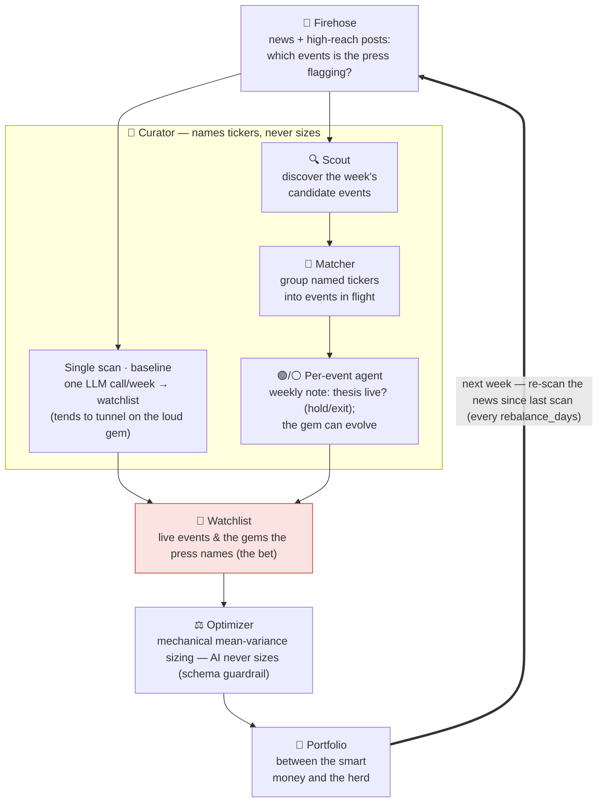

# geo-herd-rider

**Author:** Joe Hahn  
**Email:** jmh.datasciences@gmail.com  
**Date:** 2026-Jun-23 <br>
**branch:** main

> **Scope of this README.** This document describes the **backtested** solution only — how the
> machine reads history and is scored against it. Live/forward operation is deliberately left out
> for now (it will be folded back in later); everything here is measured on historical data.

**Our model of the market.** Two groups move a price. The **smart money** (insiders and genuinely expert investors) have a real edge, they get to move first and they reap the greatest rewards. Then the **slow herd** arrives late to pile in and flatten the opportunity. We are neither. We have no inside information and no deep-investor edge, but we do have **data** (news, posts, reports, prediction markets) and **AI to manage that data**. Our play is to use that data's leading indicators to infer *where the smart money is already heading* and position us **between the smart money and the herd**; late enough such that the direction is discernable and early enough to capture some of the move before the herd arrives and prices it away. And just as we ride in ahead of the herd, we ride out as it shows up: once the herd has piled in and flattened the opportunity that position has done its work, so we pivot off to the next event whose opportunity is still un-grazed.

**The core idea.** We don't reason out a causal chain to *find* the next winner — the financial press already publishes the answer, by ticker, and it does so repeatedly and progressively earlier as a move builds. A niche tanker-freight ETF (BWET) was named in print as a standout trade — *"the best-performing ETF of 2026 … flown under the radar"* — weeks before it tripled again. The edge is simply to be **reading**: enter when the press names a ticker on a *live* thesis, ride while that thesis holds, and exit when it decays. AI is never used to predict *how big* a move will be — only which ticker, and whether its thesis still holds, while a non-AI mechanical optimizer sizes it.

**What this repo does.** Each week (of historical news) an LLM reads the news firehose as well as some high-reach posts, extracts the US-listed tickers the press explicitly **names** as thesis-driven movers, and curates a watchlist. A plain mean-variance optimizer then weights that watchlist. A position is **held while its driving catalyst is live** and **dropped when the thesis decays** (ceasefire signed, chokepoint reopens). The whole run is then scored against a locked set of historical "gems."

## How it works, at a glance

The machine is one short assembly line **run on a loop, once a week**. We **read the firehose** to spot the **events** the press is flagging — a war, an election, a supply shock, as well as the **gem(s)** that each event throws off (namely the tickers journalists name for it). A **scout** discovers those events; a **matcher** groups each week's named tickers into the events already in flight; and then a **per-event agent** **tracks each event over time**: an event can last weeks, months, or years, and the gem that best expresses it can *change* as it unfolds. We hold the gem while its agent deems the event's thesis alive and exit when it **resolves**; a **plain optimizer** (never the AI) sizes the portfolio.



The whole assembly line **runs once per `rebalance_days` (default 7 = weekly)** and marches week by week across the era — that's the thick loop edge. Each pass re-reads the firehose, the per-event agents re-ask *"is this event's thesis still live, or has it resolved?"*, the gem that best expresses a held event can change, and the optimizer re-sizes. An event isn't rediscovered from scratch each week: its agent remembers what it concluded last week (its prior-week note), and the position stays on (a "sticky hold") through quiet weeks — so each event is tracked continuously until its agent calls the exit.

The red highlighted box is where our advantage comes from: the press has already flagged a live catalyst (the **event**) and named the tickers that express it (its **gem(s)**), so we never have to predict the winner ourselves — we just read the name the press has given and ride it while its thesis holds.

**Every box has a home below** (and every component discussed below is a box above):

| Box | Where it's described |
|---|---|
| 📰 **Firehose** | [The news firehose](#the-news-firehose-why-reading-beats-reasoning) |
| 🧠 **Curator** (Single scan · Scout · Matcher · Per-event agent) | [Inside the curator](#inside-the-curator-scout--per-event-agents) |
| 🎯 **Watchlist / the bet** | [The signal, and its jobs](#the-signal-and-its-jobs) |
| ⚖️ **Optimizer** (+ schema guardrail) | [The signal, and its jobs → Sizing](#the-signal-and-its-jobs) |
| 💼 **Portfolio** | [Live dashboard](#live-dashboard) |

## The news firehose: why reading beats reasoning

We don't screen all tickers to discover gems, the financial press already does the gem-discovery and names the ticker, repeatedly, and progressively earlier as a move builds. BWET, in the 2026 Iran war:

| Date | Outlet | Framing | from this date → peak |
|---|---|---|---|
| **Mar 4** | etf.com | *"best-performing ETF of 2026 … flown under the radar"* | **~3.2×** |
| Mar 20 | ETF.com | *"skyrocketing … still flying under the radar"* | ~2.3× |
| Apr 9 | Business Times | *"a 1,300% rally … an Iran war gauge"* | ~1.5× |
| Apr 25 | CNBC | *"up over 600% … better than oil or energy stocks"* | mainstream |

The progression in that last column — *"under the radar" → "everyone piling in"* — traces a gem moving from the smart money to the slow herd; reading it early is the whole point. We enter the gems the press names on a *live* thesis and **exit on thesis decay** — the question "when do we drop BWET?" answers itself: when the catalyst resolves (the Strait of Hormuz reopens, a ceasefire is signed) and freight rates roll over, *not* when the coverage merely gets crowded.

**Where the news comes from.** The firehose has two modes, and they must use *different* news sources, because reading *historical* news is a fundamentally different problem from reading *this week's*:

- **Live use — running the solution going forward, week to week.** The firehose is **Anthropic web search** — *not* a bulk download of every article published that week. Instead the curator answers a single question — *which tickers is the press naming as thesis-driven movers this week?* — by running its own web searches for exactly that, reading the headline + snippet of each result, and returning the tickers the press flags. From that single question Claude spawns its own follow-up searches (no fixed list; it adapts to whatever's live that week), capping every search to news dated today or earlier.

- **Backtest — replaying history to score this solution.** Here a normal web search is *poison*: searching old news *today* silently re-imports the future — its date filters leak post-cutoff articles, its results are ranked by what *later* became famous, and it returns today's edited page. **Which is why this solution uses GDELT + Wayback:** **GDELT** is the only date-honest discovery index — server-enforced date bounds, and results ordered *by date, not relevance* (so a gem's early article isn't boosted because it later mooned). We query it with the same gem-agnostic beats (theme superlatives, never the ticker):
  ```
  GDELT:  query="best performing stock"  startdatetime=20260206000000 enddatetime=20260213000000 sort=datedesc
  GDELT:  query="defense stocks"          startdatetime=20260206000000 enddatetime=20260213000000 sort=datedesc
  ```
  GDELT's catch is that it returns **headlines only**, and a headline names the *theme*, rarely the *ticker* (the "(BWET)" lives in the lede). Two fixes recover that naming without re-importing the future. First, **Wayback** enrichment fetches each GDELT hit's *as-of-date* archived lede — URL-keyed archival, so none of web search's three leaks (opt-in `--enrich`, under validation):
  ```
  Wayback CDX:  latest snapshot of <url> with to=20260213  ->  fetch lede ("...Breakwave Tanker Shipping ETF (BWET)...")
  ```
  Second, **seeds** inject the niche early pieces GDELT misses at their true dates (still the default).

The backtest's GDELT queries are deliberately **gem-agnostic** — superlatives plus the standard beats the live prompt already names — *not* terms reverse-engineered from the gems we know won. Full retrieval decision matrix is in [`agent_design.md`](agent_design.md#retrieval-gdelt-and-seeds-current).

The ticker that motivates this project is **BWET**. In the 2026 Iran war it ran **~8×** from its spark — Iran's late-December 2025 currency collapse and mass protests, which drew Trump's "armada" toward the Gulf — to its May peak, while SPY sat flat. The edge isn't knowing BWET will run 8× — it's *reading the article that names it* early enough to ride the back half (still ~3× from the first "under-the-radar" write-up). The May plateau is the three-tier model in one line: as the press turned toward peace, smart money rotated out while the slow herd kept backfilling.


## Live dashboard

[A $50K portfolio traded through the solution](https://joehahn.github.io/geo-herd-rider/) — value vs SPY, allocation over time, a [firehose log](https://joehahn.github.io/geo-herd-rider/firehose.html) of the week-by-week press-named gems, and an LLM-cost panel. The on-screen portfolio is the **event-first agent** finding BWET in a **realistic, noisy GDELT news firehose** — with BWET's early under-the-radar article **seeded** (real search misses those niche early pieces; see Status), so it's the only retrieval shortcut taken. It is a **hindsight upper bound** (seeded entry + a model trained past the events), not a promise — read it as the ceiling the mechanics can reach on clean inputs (see Status). Rebuild with `python scripts/build_dashboard.py`.

## The signal, and its jobs

One source, three jobs — plus mechanical sizing:

- **Read** — *what's worth owning.* The news firehose (and high-reach posts via `trump_feed.py`, point-in-time-sliceable) — the tickers the press explicitly **names** as thesis-driven movers. The human never picks.
- **Enter** — *the press names it on a live thesis.* The human never sets the trade; the curator just reports which tickers the press is naming as live movers.
- **Exit** — *is the thesis still live?* Hold while the driving catalyst is active; drop it when the press says it's resolving. Mainstream hype ("up 600%, everyone piling in") is **not thesis death** — only the catalyst resolving ends the hold.
- **Sizing** — mechanical (the ⚖️ **Optimizer** box). A standard mean-variance optimizer weights whatever watchlist results, tuned only by `investor_profile.md`. The LLM never touches the numbers, and a schema guardrail (below) drops any magnitude it tries to emit.

Cadence is **one knob** (`rebalance_days`, default 7 = weekly): it sets both how often the firehose re-scans/re-optimizes *and* the trailing news window each scan reads — they're the same thing ("the news since the last scan"). A position persists across scans via a [sticky hold](agent_design.md#sticky-hold-hysteresis-current) (it exits on confirmed thesis death or prolonged silence), so coverage gaps don't churn it.

Scope is **US-listed instruments, including ADRs and country/theme ETFs** — so a foreign event (a war, an election) is captured via its US-listed proxy (e.g. YPF / ARGT for Argentina), which is both how the US press names it and what a retail brokerage can trade.

## Inside the curator: scout → per-event agents

**Each week the engine discovers, then fans out.** Discovery poses a single question to the firehose — *which tickers is the press naming as thesis-driven movers this week?* — and surfaces a few candidate events (a scout call reads the whole week's coverage; you can't target-search an event you haven't found yet, so discovery must be broad). The engine then **fans out one agent per live event** — the new candidates plus every event already being held — each running in parallel: it pulls *its own* event's news, updates its one-week memory, and makes the hold-or-exit call. The live events' current tickers become the watchlist the optimizer sizes. Next week, repeat.

The curator runs in one of two modes, both feeding the same optimizer — the two leftmost paths in the diagram:

- **Single scan** (the baseline) — one LLM call per week reads the whole firehose and emits the watchlist. Simple and cheap, but it tends to *tunnel on the loudest gem* and grab thematic noise.
- **Scout → per-event agents** (the current engine) — a **scout** reads the firehose to *discover* candidate events; then every held event gets **its own agent** that, each week:
  1. pulls news **targeted to that event** (its own catalyst — including resolution signals like a ceasefire);
  2. reads **only its prior week's note** — a rolling, one-entry-deep memory that's *superseded* each week, so old (and possibly wrong) conclusions don't pile up and anchor future thinking;
  3. writes a new note: a short assessment, the **`thesis_live` / exit** call (the *only* thing that drives the hold/exit), and hot-linked sources.

  The live events become the watchlist; the optimizer sizes. The journal (`data/windows/agent_journals.json`) is the human-readable audit trail. Discovery is aggregate (you can't target-search an event you haven't found); only *monitoring* a held event uses its own targeted search — so it doesn't bias what we discover.

  *Implementation note — two agent engines:* **`--agent`** is ticker-keyed (the original: one journal per ticker); **`--event-first`** makes the **event** first-class (`agent.run_event_agent_scans`) — an LLM **matcher** groups this week's tickers into existing events (so RNMBY/RHMTY/LMT collapse into *one* defense event), and the per-event agent holds the **purest current vehicle**, which can *evolve* week to week. The ticker-keyed engine stays as the A/B baseline. The 13-gem run showed why this matters — it fragmented single events across many tickers (RNMBY and RHMTY are the same company under two ADRs); event-first is the fix. See [`agent_design.md`](agent_design.md).

**Guardrail, machine-enforced.** The agent's output is validated by a Pydantic schema with **no field for a price target, magnitude, or position size** — so even if the model emits one, it's *dropped* before it can reach the optimizer. The LLM picks composition and the *when-to-exit* call; sizing stays mechanical. (It may *attribute* a figure to the press — "press cites ~600% YTD" — but never forecasts its own.)

## Models — one seam, pick by need

Every LLM call routes through a provider-agnostic seam (`src/llm.py`), so the same pipeline runs on Anthropic (Opus/Sonnet/Haiku) or any OpenRouter model (DeepSeek, MiMo, …) via `--provider`/`--model`, with structured-output JSON schemas keeping cheap models' output clean. A BWET bake-off found **Sonnet, MiMo, and Opus statistically tied** (all rode BWET the full ~4×/16 weeks, ~+200%), while DeepSeek *under-held* the winner (exited early). So **development runs on MiMo v2.5-pro** (~1/14 of Opus's cost, matched it on BWET) and **Opus is reserved for the final numbers**. Every call's cost is priced into `data/llm_costs.csv`.

## Harvesting the distribution, not one gem

Event-driven runs are heavy-tailed: BWET is a tail outlier, and below it sit progressively more numerous, smaller analogs. So the objective is to **harvest the distribution** — reliably ride the many medium-tier events — not to time one jackpot. The system is therefore measured against a locked multi-event test set (`data/fixtures/gems.json`, window 2022-09 → present, US-listed incl. ADRs/ETFs), balanced across **verticals** (AI, nuclear, crypto, healthcare, defense, shipping, EM-energy, materials, consumer, precious-metals) and **geopolitical types** (war ×2, election, trade-war):

> CVNA ~100× · PLTR 32× · NVDA 17× · SMR 16× · SMCI 14×↘ · MSTR 13× · HIMS 11× · RNMBY 8× · BWET ~8× · MP 6.5× · YPF 4.4× · GDX 3.5× · URA 3.2× — plus PTON (a slow-fizzle *negative control* for the exit engine).

This measures **recall** (how many gems the firehose catches) and the **exit engine** (does it cut a decaying thesis); **precision** (false positives — does it also grab hyped names that fizzle?) is measured separately by the realistic GDELT-noise run.

## Status

The firehose pipeline is built end-to-end and runs over historical news; below is what it scores so far and how those numbers should be read.

**Pipeline.** `firehose.py` runs the single-scan curator; `agent.py` runs the scout→per-event-agent curator (the current engine). Both hand the live watchlist to the reused mean-variance optimizer (`investor_profile.md` knobs); `scripts/run_harness.py` scores either against the gem set; the dashboard renders the portfolio. Every LLM call is priced into `data/llm_costs.csv`.

**Results so far.**
- *Single-scan baseline (13 gems, realistic GDELT retrieval):* early-recall **0%**, portfolio **+42% vs SPY +98%** — it catches the right *themes* but late and via the wrong *vehicle* (GGAL not YPF, CCJ not URA), drowned in noise. The honest floor.
- *Retrieval decomposition (seed the early articles):* early-recall jumps **0% → 92%**, portfolio **→ +318%** — proving **retrieval, not reasoning, is the wall** (given the early naming, the engine picks the right ticker and rides it).
- *Per-event (ticker-keyed) agent vs single-scan:* on the BWET window it rode BWET the full 16 weeks (4.13×) with a *resolution-aware* exit — **+189–224%** (Opus/Sonnet/MiMo) vs the single-scan's **+87%**. Across the **13 gems** it generalized — early-recall **85%**, precision **37%** (vs 27%), portfolio **+1344% vs SPY +98%** (a stacked upper bound) — but **fragmented single events across many tickers** (RNMBY/RHMTY are the same company; nuclear split across SMR/OKLO/CCJ/CEG). That motivated the event-first engine.
- *Event-first engine (built, BWET-validated):* makes the **event** first-class (LLM matcher + a deterministic same-ticker guard + evolving vehicles). BWET-era spot-check: the guard collapses BWET to **one** event (was three), and the matcher correctly groups distinct vehicles of one catalyst (LHX + RKLB → a single defense event). Not yet A/B'd on the 13 gems.
- *Model bake-off (BWET):* Sonnet, MiMo, and Opus are a dead heat (all rode BWET full, ~+200%); DeepSeek under-holds. Dev on **MiMo** (~1/14 Opus's cost), Opus for final numbers.

**Two backtest surfaces.**
- `firehose.py --fixture` — a look-ahead-clean **mechanics** test against a fixed article set (perfect-retrieval assumption): given the early articles, the engine enters BWET on its first under-the-radar write-up and rides it while the Iran/Hormuz thesis is live (~+220% vs SPY ~+9%, BWET-only). An upper bound on the mechanics, not lift.
- `firehose.py --gdelt --seed <file>` — a **realistic** backtest: real date-honored GDELT headlines per week (`src/gdelt.py`) + the early niche pieces GDELT misses, seeded at their true dates. The curator must *find* the gem in genuine noise — the fast dev loop for hunting weaknesses (it drove a sticky-hold, selectivity/vehicle-selection, and ticker-validation hardening). **This is the surface the [live dashboard](#live-dashboard) renders** (event-first agent, +393% vs SPY +7%). Still a hindsight upper bound.

**Why every number here is an upper bound.** No search tool gives true point-in-time retrieval — Anthropic's `before:` and Tavily's `end_date` leak post-cutoff articles, and the early "under-the-radar" pieces don't rank into a date-bounded pull (`src/search.py` enforces a hard client-side date bound, and even then they're missed). [**GDELT**](agent_design.md#retrieval-gdelt-and-seeds-current) (`src/gdelt.py`) *does* honor dates, but under-indexes niche trade press, so it picks a gem up only once mainstream piles in (late) — which is why the early pieces are seeded back at their true dates (a backtest shortcut, so seeded numbers are upper bounds). On top of that, the curator model was trained past these events. So every backtest figure above is a **ceiling**, reported as such — never read it as realized lift.

**Backtest roadmap (this README's scope).** We harden the engine on a widening historical slice, one rung at a time:
1. **BWET alone** — lock the mechanics on the single motivating gem (enter early, ride, exit on resolution).
2. **BWET + its two nearest-in-time gems** — confirm the scout/matcher keep separate events separate and the optimizer shares capital sanely across a handful of concurrent events.
3. **The full locked gem set** (`data/fixtures/gems.json`) — recall / precision / tail / exit across all verticals and geopolitical types.

Later phases extend beyond backtesting and are intentionally out of scope for this README; they'll be folded back in once we get there.

## Setup

```bash
git clone <this repo>
cd geo-herd-rider
python3.12 -m venv .venv
source .venv/bin/activate
pip install -r requirements.txt

# The LLM curator calls the Anthropic API — bring your own key.
cp .env.example .env        # then edit .env, or just export the var:
export ANTHROPIC_API_KEY=sk-ant-...
# optional: OPENROUTER_API_KEY (cheap models), TAVILY_API_KEY (date-bounded news search)
```

`.env` is gitignored, so your key is never committed.

## Run it

**Mechanics test (fixture — look-ahead-clean, assumes perfect retrieval):**

```bash
python src/firehose.py --fixture data/fixtures/firehose_bwet.json --start 2026-02-06 --end 2026-06-18
python scripts/build_dashboard.py          # rebuild the $50K dashboard (no LLM cost)
```

**Scored multi-event harness (the dev loop — recall / precision / tail vs the gem set):**

```bash
# Single-scan baseline (Opus) over the gems.json window:
python scripts/run_harness.py

# Scout->per-event-agent variant, on the cheap dev model (MiMo via OpenRouter):
python scripts/run_harness.py --agent --provider openrouter --model xiaomi/mimo-v2.5-pro

# Add --seed data/fixtures/gems_seeds.json for the retrieval-perfect overlay (decomposition).
# GDELT pools cache after the first (throttled) fetch. All figures are hindsight upper bounds.
```

## Notes

Developed with [Claude Code](https://claude.com/claude-code). See [`CLAUDE.md`](CLAUDE.md) for the rules Claude follows in this repo, [`agent_design.md`](agent_design.md) for the per-event-agent design, [`TODO.md`](TODO.md) for backlog, [`scripts/`](scripts/README.md) for how to run each script, and [`prior-work/`](prior-work/) for the earlier experiments this design builds on.

## Disclaimer

Technical demo. Not financial advice. Historical performance is not predictive. Do not trade real money on this output.

## License

MIT.
