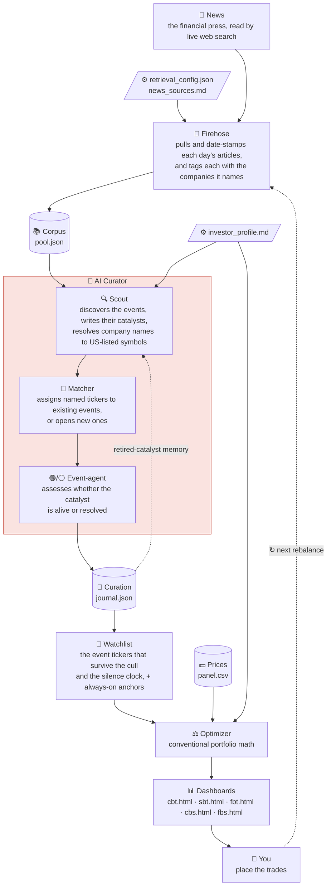
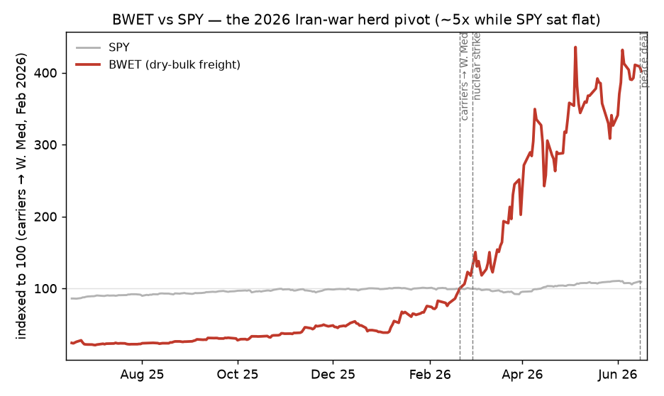

# geo-herd-rider

**This project:** An AI agent reads a continuous feed of unstructured news and makes a routine
judgment call a person would otherwise make by hand, while deterministic code handles everything
that can be computed rather than judged. The domain here is investing; the pattern is not.

**Author:** Joseph M. Hahn, Ph.D., an independent AI and machine learning consultant. [jmh-datasciences.com](https://jmh-datasciences.com) · [LinkedIn](https://www.linkedin.com/in/hahnjoe/) · jmh.datasciences@gmail.com

**License:** Writing & dashboards [CC BY 4.0](LICENSE-docs.md) · code [PolyForm Noncommercial](LICENSE.md), [details](#license)  
**Project:** Started 2026-Jun-23 · branch `main`  
Built end-to-end with [Claude Code](https://claude.com/claude-code).

> **Not investment advice.** A research project and a demonstration of automated
> decisioning. Every performance figure below is a hindsight upper bound, not
> realized return.

---

## Introduction

**Our model of the market.** Two groups move a price. The **smart money** (insiders and genuinely expert investors) have a real edge, they get to move first and they reap the greatest rewards. Then the **slow herd** arrives late to pile in and flatten the opportunity. We are neither. We have no inside information and no deep-investor edge, but we do have **data** (news, posts, reports, prediction markets) and **AI to manage and interpret that data**. Our play is to use that data's leading indicators to infer *where the smart money is already heading* and position us **between the smart money and the herd**. We also must first discern where the smart money is headed, so we inevitably arrive a bit late, but with the goal of arriving early enough to capture some of the move before the slow herd arrives and prices it away. And just as we ride in ahead of the herd, we must also ride out as it shows up. Once the herd piles in and flattens the opportunity, that position has done its work and so we pivot off to the next event whose opportunity is still un-grazed.

**The core idea.** We don't reason out a causal chain to *find* the next winner. The financial press already publishes the answer, by ticker, naming the winner **early** (while it's still under the radar), and then repeatedly and more loudly as the move builds. For example, the niche tanker-freight ETF (BWET) was named in print as a standout trade, *"the best-performing ETF of 2026 … flown under the radar"*, weeks before it tripled again. Our edge is simply to be **reading**: enter when the press names a ticker on a *live* thesis (a *thesis* being the specific catalyst driving the ticker, here a war spiking tanker freight rates, and *live* while that catalyst is unresolved), ride while the thesis holds, and exit when the catalyst resolves. AI is never used to predict *how big* a move will be, only which ticker or tickers to monitor, and whether its thesis still holds, while a non-AI mechanical optimizer sizes the recommended portfolio.

**What this repo does.** Month by month across three years of business news, an AI curator reads the news firehose, extracts the US-listed tickers the press explicitly **names** as thesis-driven movers, and maintains a watchlist of the events driving them. A standard portfolio optimizer then decides **how much to hold of each name**, sizing them from their trailing returns and volatility, the same math a robo-advisor uses. A position is **held while its driving catalyst is live** and **dropped when that driver goes away** (a ceasefire is signed, a chokepoint reopens). The published backtest replays that loop over an archived corpus of nearly 100,000 articles running from August 2023 to August 2026.

## How it works, at a glance

This solution is an assembly line that loops once per rebalance. It reads the news firehose to spot the **events** the press is flagging. Each event is driven by a **catalyst**, a discrete cause such as a war, an election, or a supply shock, and that catalyst drives specific tickers up. An event is expressed through one or more **vehicles**, the tickers named explicitly by the journalists covering the event. Every vehicle in an event carries the same **thesis**: that event's catalyst is what should drive the ticker up. Three AI stages do that reading: a **scout** discovers the events and writes each thesis; a **matcher** groups each period's named tickers into the events already in flight; and an **event-agent**, one per event, **manages that event over time**. An event can last weeks, months, or years, and the vehicle or tickers that best express it can change as it unfolds. The **watchlist** is the pooled set of tickers the live events are recommending. A vehicle stays on it while its thesis is **live** (the catalyst still active and unresolved) and comes off when the catalyst **resolves** (the war ends, the chokepoint reopens, the bill is signed), an **exit** the event-agent writes. A **plain optimizer** (never the AI) then distributes the portfolio's dollars across that watchlist.


```mermaid
flowchart TD
    N["📰 News<br/>the financial press, read by live web search"]
    CFG[/"⚙️ retrieval_config.json<br/>news_sources.md"/]
    N ~~~ CFG
    CFG --> FH
    N --> FH
    FH["🚰 Firehose<br/>pulls and date-stamps each day's articles,<br/>and tags each with the companies it names"]
    FH --> POOL[("📚 Corpus<br/>pool.json")]
    POOL --> SC

    subgraph CUR["🧠 AI Curator"]
      direction TB
      SC["🔍 Scout<br/>discovers the events, writes their catalysts,<br/>resolves company names to US-listed symbols"]
      MA["🧩 Matcher<br/>assigns named tickers to existing events,<br/>or opens new ones"]
      AG["🟢/⚪ Event-agent<br/>assesses whether the catalyst<br/>is alive or resolved"]
      SC --> MA --> AG
    end

    PROF[/"⚙️ investor_profile.md"/]
    PROF --> SC
    PROF --> OPT

    AG --> J[("📓 Curation<br/>journal.json")]
    J -. "retired-catalyst memory" .-> SC
    J --> WL
    WL["🎯 Watchlist<br/>the event tickers that survive the cull<br/>and the silence clock, + always-on anchors"]
    WL --> OPT
    PX[("💵 Prices<br/>panel.csv")] --> OPT
    OPT["⚖️ Optimizer<br/>conventional portfolio math"]
    OPT --> D["📊 Dashboards<br/>cbt.html · sbt.html · fbt.html · cbs.html · fbs.html"]
    D --> U["🧑 You<br/>place the trades"]
    U -. "↻ next rebalance" .-> FH

    style CUR fill:#fae3e0,stroke:#c0392b
```

The shaded **AI Curator** box is where the advantage comes from, and it holds every judgment call in the pipeline: the press has already flagged a live catalyst and named the tickers that express it, so this solution never has to predict the winner itself. It reads the ticker the press named and rides it while the thesis holds. Everything outside that box is deterministic Python, apart from the article tagging in the firehose.

The `investor_profile` enters the solution **twice**. **Curation knobs** are the settings in `investor_profile` that act upstream of the journal, governing which articles are read, which the scout is shown, and which events open and when they retire. Changing one means the existing curation journal could never have been produced under it, and the news has to be re-read at LLM cost. **Book knobs** are the ones that act at replay time over a fixed journal, covering sizing, culling and rebalancing. Changing one simply re-sizes the same curation and the page rebuilds in seconds. [`agent_design.md`](agent_design.md) has the mechanics. There are two profile variants, one for the backtest and one frozen for the live forward run, kept in sync on the strategy knobs so the backtest stays a valid proxy for the thing that runs forward.

The assembly line marches period by period across the era. Each pass re-reads the firehose, each event-agent re-asks whether its event's thesis is still live and names the vehicle or vehicles that best express it, and the optimizer rebalances. **Sizing is mechanical**: the AI names tickers and makes the hold-or-exit call, and never sets a position size.

## The news firehose

This solution doesn't screen all tickers to discover gems. The financial press already does that work and names the ticker, repeatedly, early while it's under the radar and then louder as the move builds. Here is BWET's news-history during the runup to the 2026 Iran war:

| Date | Outlet | Framing | from this date → peak |
|---|---|---|---|
| **Mar 4** | etf.com | *"best-performing ETF of 2026 … flown under the radar"* | **~3.2×** |
| Mar 20 | ETF.com | *"skyrocketing … still flying under the radar"* | ~2.3× |
| Apr 9 | Business Times | *"a 1,300% rally … an Iran war gauge"* | ~1.5× |
| Apr 25 | CNBC | *"up over 600% … better than oil or energy stocks"* | mainstream |

The progression in that last column, from "under the radar" to "everyone piling in", traces a gem moving from the smart money to the slow herd, and reading it early is the whole point. This solution enters the vehicles the press names on a live thesis and exits on thesis decay. The question "when to drop BWET?" answers itself: the position is dropped when the catalyst resolves (the Strait of Hormuz reopens, a ceasefire is signed) and freight rates roll over, not when the coverage merely gets crowded.

**Where the news comes from.** The firehose is a live web search plus a daily pull, not a bulk download of everything published. The curator answers a single question, *which tickers is the press naming as thesis-driven movers?*, by running its own searches for exactly that, reading each result's headline and snippet, and returning the tickers the press flags. From that one question the model spawns its own follow-ups, adapting to whatever is live that week rather than working a fixed list, with every search capped to news dated today or earlier. It rides a general-purpose web index, so it reaches the niche trade press, returns the content snippet rather than just a headline, and indexes fresh pages within days, which is why a just-published under-the-radar write-up is reachable as it appears.

**What it searches for** is a fixed, factored set of beats kept in `retrieval_config.json`, and they split in two. **Ten gem beats** carry the early framing this strategy hunts for (*little-known small cap catalyst*, *overlooked stock catalyst*, *niche ETF surging*, *war chokepoint beneficiary*, *export ban beneficiary*), while 33 sector-coverage beats sweep the market broadly, coarse enough that no gem's sub-niche is ever named. Querying by ticker is excluded on purpose, because that is reverse-engineering from known winners. That same early framing then runs again as a headline filter, the **gem tell** (*under the radar, flying under, little-known, overlooked, still early, nobody is talking*), which admits a small slice of what arrives and is what the scout actually reads. Both are deterministic.

**The pull runs daily**, not once per rebalance, because it is *unrepeatable*: search results are not re-queryable and articles get edited, paywalled or deleted, so a skipped day is a permanent hole in the record. What it accumulates is the archive the curator reads at each rebalance, and the same archive the published backtests replay against.

The ticker that motivates this project is **BWET**. In the 2026 Iran war it ran ~8× from its spark (Iran's late-December 2025 currency collapse and mass protests, which drew Trump's "armada" toward the Gulf) to its May peak, while SPY sat flat. The edge isn't knowing BWET will run 8×, it's reading the article that names it early enough to ride the back half, still ~3× from the first "under-the-radar" write-up. The May plateau is the three-tier model in one line: as the press turned toward peace, smart money rotated out while the slow herd kept backfilling.



## Inside the curator

Each period the curator **discovers, then fans out**: a broad **scout** call asks the firehose *which tickers is the press naming as thesis-driven movers?* and writes each one's catalyst and thesis; a **matcher** folds them into the events already in flight; and then **one event-agent per live event** takes the slice of the period's news that names its own vehicles or catalyst, re-reads its full journal arc, writes a one-line critique of its own last call that is allowed to change this one, and makes the hold-or-exit call. The live events' tickers become the watchlist the optimizer sizes.

The scout is kept selective by a **catalyst gate**: it names a ticker only on a *specific, datable, resolvable* catalyst (a war, a named bill, an export ban), rejecting pure theme and momentum, with a refinement that also admits **anticipation of a dated future event** (an election, an FDA date) whose date is the exit; this is how MicroStrategy was caught riding Bitcoin into the 2024 vote. The design behind it (the same-catalyst **peer-basket**, the self-critique loop, and the gate's full admissibility rules) is in [`agent_design.md`](agent_design.md).

### How the core pieces fit together

The one thing the [pipeline diagram](#how-it-works-at-a-glance) cannot show: one **event**, defined by its **catalyst**, is managed by one **AI agent**, and that agent maintains a **basket** of same-catalyst tickers — a rearmament catalyst → Rheinmetall + BAE + Saab + Thales. The agent, not the ticker, is the durable unit this solution tracks, so the basket can change as the event unfolds, and several agents run concurrently, each proposing its own baskets.

- An **event** is first flagged by the **scout**; it is the real-world thing that is unfolding, and it has a storyline that this solution is tracking (e.g. "Hormuz blockade").
- A **catalyst** is the event's spine that is documented by the **scout**. It is the continuous driver that runs through the entire event, preferably one that will ultimately resolve, with that resolution known as the **exit**. For the "Hormuz blockade" event the spine is *Iran's push to close the Strait of Hormuz*, and that event resolves with a *ceasefire*. An event can have multiple tickers associated with it, and they all share the same catalyst.
- **Milestones** are the vertebrae on the spine, they are the developments along the way (*protests in Iran → a US carrier group to the Med → strikes on Iran → the Hormuz closure itself*) that keep the catalyst *live*. The **event-agent** tracks that arc period to period, and it is the arc, not any score, that its exit call is argued against.
- An **exit** is the agent writing its event off as no longer worth holding. It is where the milestone spine ends: the basket stops reaching the watchlist, so the optimizer will not fund those tickers at the next rebalance. What counts as no-longer-worth-holding, why a resolved catalyst does not by itself sell, and how the event is remembered afterwards are [below](#an-events-life-silence-exit-and-memory).
- A **thesis** is what ties a vehicle to its event: the event's catalyst, read at the vehicle level. The **scout** writes one catalyst per event and every vehicle in the basket carries it, so an event's vehicles share one thesis rather than each having its own.
- A **vehicle** is an in-demand ticker an event is expressed through, and an event can have several. The **scout** names the vehicle or vehicles, and the **matcher** merges every ticker that names the same catalyst into ONE event (so that upticks by RNMBY and RHMTY and LMT are regarded as a single defense event rather than three distinct events) and assigns those same-event vehicles to the event's **basket**, which can evolve as the event unfolds since the event is pinned to the catalyst and not to any particular tickers. The matcher is an AI stage and it under-merges under load, so a deterministic pass behind it folds together any live events left holding an identical catalyst. Each **event-agent** proposes its basket, and the live baskets pool into the **watchlist**, which caps how many *tickers* compete for capital rather than how many events may run. How the cull picks them is [below](#how-events-and-tickers-are-trimmed).
- The **anchors** are the safe-harbour tickers named in `always_include`, a broad-market fund and a cash equivalent in the shipped template. They are not events and no agent stands behind them. They ride **post-cull**, appended to the optimizer's universe after the event-agents have been trimmed, so they never take a watchlist slot from an event and idle capital always has somewhere to sit when the events are weak or few. The optimizer simply sizes them alongside whatever the cull kept.

### An event's life: silence, exit, and memory

A period with **no fresh coverage** of an event is not an exit and does not weaken it. The agent's note is
carried forward deterministically: same thesis, same vehicles, no LLM call at all, which is where most of
the curation's cost would otherwise go. A resolution can only arrive *in* the news, and news means the agent
runs, so nothing is missed by staying quiet. There is no confidence score anywhere in this: the agent owns
the live/exit switch, its own standing exit condition, the milestone arc, and which vehicles express the
event, and nothing else.

An event is not rediscovered from scratch each period. Its agent reads its own prior notes, and the position stays on through quiet stretches, so an event is tracked continuously until its agent calls the exit. There is **one exit**: the agent reading the thesis as no longer live, on `exit_patience_scans` consecutive reads, so a single bad period cannot close a good thesis. A thesis dies one of two ways. **The catalyst resolved:** the awaited event happened, so the uncertainty that made the position worth holding is gone. **The window closed:** it has not happened, nothing concrete is scheduled that would make it happen, and coverage has gone mainstream, so nothing new is coming and the move is already priced in. Heavy coverage on its own is neither. While a concrete step is still scheduled ahead, a set summit date or a filed deal awaiting a known ruling, the position holds however crowded the coverage gets.

Resolution never sells by itself. When a catalyst resolves it is the agent that calls the thesis dead, and the position then exits the normal way. What resolution does on its own is stop new money: a resolved catalyst keeps the position it has, but cannot be bought into. And once an event ends, its ticker is **remembered**: the journal carries a roster of retired catalysts — those that resolved, that aged out of the scan cap, or that lost their slot when more events were live than may run at once — and the scout is shown that roster each period so it won't re-open the same ticker on lingering hype. An event that merely went quiet is deliberately **not** on it, because silence is absence of evidence rather than evidence the thesis died, so returning coverage can revive it. A ceasefire already signed isn't a fresh catalyst, though a genuinely new event can let that ticker back in.

### How events and tickers are trimmed

Two culls run, on different things at different stages. **The events cull** bounds how many events may be
live at once (`max_events`), and when more are live than that, a ranking decides which keep their slot: an
arithmetic coverage-rank (`src/evscore.py`) by default, or an **LLM agent-picker** (`src/picker.py`) that
ranks each live event on its evidence arc (catalyst, milestones, exit condition, periods alive) and never on
a predicted return or size. It is deliberately a *concurrency* cap and not an admission cap, so a strong
thesis arriving in a busy week competes again next period instead of being binned at the door. An event
culled here is retired, and joins the roster the scout is shown.

**The portfolio cull** then decides which of the surviving events' tickers hold capital, when they name more
than `max_watchlist` allows. It ranks on a **price trend**, holding a couple of slots open for brand-new
events that have no price history for a trend to read yet. Neither cull reads a confidence score, because
there isn't one.

The two sit on opposite sides of the line drawn above: `max_events` is a curation knob, since changing it
changes the journal, while `max_watchlist` is a book knob that only re-sizes a curation already made.

**No-magnitude guardrail, machine-enforced.** Every LLM stage returns JSON matching a fixed Pydantic schema whose fields are only `ticker`, `thesis`, `thesis_live`, `catalyst_resolved` and the like, with **no field for a price target, weight, or size**, and `extra='ignore'` silently drops any number the model volunteers ("buy 8% of BWET"). So the LLM picks composition and the *when-to-exit* call only; the mechanical optimizer sets every weight.

## Dashboards

Everything below is published as browsable pages at **[joehahn.github.io/geo-herd-rider](https://joehahn.github.io/geo-herd-rider/)**, and every figure on them is a hindsight upper bound rather than realized lift (see [Status](#status)).

**Backtest.** Three years of business news, August 2023 to August 2026, replayed month by month:

- [**Firehose Backtest (FBT)**](https://joehahn.github.io/geo-herd-rider/fbt.html). The health of the news pool the curator reads: what the ingestion funnel keeps and what it drops, coverage over time, how much of it arrives with enough text to reason over, and which beats and sources actually produce.
- [**Curator Backtest (CBT)**](https://joehahn.github.io/geo-herd-rider/cbt.html). What the curator held and when: realized portfolio value against its controls, watchlist composition, the event timeline, the cull funnel, and gain attributed per holding and per beat.
- [**Sweep Backtest (SBT)**](https://joehahn.github.io/geo-herd-rider/sbt.html). How the outcome moves as each parameter is swept across a grid, scored on return against drawdown, Sharpe, cancellation and hit-rate, and which knobs are worth moving next.

**Bootstrap.** The same machinery on a transition corpus: about three months of the backtest's own retrospective news running up to a clean cut on **2026-07-28**, and from there the daily live pull only, extended every morning by cron. The two are never blended, because the forward test this leads to runs on the live pull alone:

- [**Firehose Bootstrap (FBS)**](https://joehahn.github.io/geo-herd-rider/fbs.html). How the bootstrap corpus is assembled, its specialty-desk reach, and how much of it is replication of the same story.
- [**Curator Bootstrap (CBS)**](https://joehahn.github.io/geo-herd-rider/cbs.html). The bootstrap book, split by whether a ticker was inherited from the backtest or introduced by this curator itself.

**Forward.** The live paper trade, and the only look-ahead-clean test this project has. The daily news pull runs every morning under cron; the weekly scan and its dashboard are still being built out, so the [dated scans](https://joehahn.github.io/geo-herd-rider/forward/) published so far are a partial record.

**Research write-ups.** Plain-English posts on one of this project's research questions at a time, with none of this repo's vocabulary in them. The first is [**What does a smarter model actually buy you?**](https://joehahn.github.io/geo-herd-rider/writeups/llm-bakeoff.html): eight models run the same judgment stage over the same 100,000-article corpus, and a frontier model grades all ~4,500 of their decisions blind.
## Optimizer

Once the curator produces the live watchlist, a **standard portfolio optimizer** sizes it, weighting each name from its recent returns and volatility, the same way a robo-advisor would, tuned only by the knobs in the investor profile ([`examples/investor_profile.md`](examples/investor_profile.md) ships the full set). The LLM never touches these weights; it only suggests tickers to the optimizer. The optimizer is **reused verbatim from [`portfolio-wave-rider`](https://github.com/joehahn/portfolio-wave-rider)** (`src/optimizer.py`), where the mean-variance math is documented in full; this project only feeds it the watchlist and reads back the weights.

## Scope

This solution trades only **US-listed stocks, ADRs, ETFs and ETNs** (BWET is an ETN), so a foreign event, a war or an election, is captured through its US-listed proxy (YPF or ARGT for Argentina), which is both how the US press names it and what a retail brokerage can trade. Options and futures never enter, and commodity and rate exposure arrives through ETFs and ETNs instead. Four rules hold that boundary, none of them the LLM's judgment:

- **A ticker has to look like one.** Every symbol the curator emits is normalized (`$RGTI`, `NASDAQ:RGTI` and `(RGTI)` all collapse to `RGTI`) and then shape-checked, which catches company names, prose, and foreign-exchange suffixes like `CSL.AX` or `7203.T`. A rejection is loud, because a silent drop would let a position the curator actually picked vanish from the book with nothing saying so.
- **A name gets a second chance before it is dropped.** A reject that looks like a company name rather than a broken symbol goes to a **ticker resolver**, a web lookup mapping it to its US listing (*Rheinmetall to RNMBY*, *Rigetti Computing to RGTI*). Only if that fails is it discarded. The lookup is look-ahead-safe: a name-to-symbol mapping is a static fact, and nothing time-varying is read from it.
- **A symbol has to have been listed at the time.** A second gate checks the symbol actually traded on or before the decision date, so a backtest cannot buy a company that had not listed yet. It is a look-ahead guard rather than a screen on youth, so a recent IPO is admissible and is handled downstream instead: too little price history to rank leaves it last in the cull, and the optimizer drops any name whose history does not span its lookback.
- **Leveraged and inverse ETFs are refused outright**, 2x and 3x and the rest. They reset leverage daily and bleed from volatility decay, which makes them day-trade instruments rather than something to hold while a catalyst plays out.

Two further gates decide funding rather than admissibility: a **liquidity floor** keeps a thinly-traded name from taking a watchlist slot, and a **death-spiral exclusion** refuses to fund a recently-listed company carrying a punitive reverse split. Full rules are in [`agent_design.md`](agent_design.md).

## Status

The pipeline is built end-to-end and runs over three years of historical news; the [dashboards](#dashboards) carry the current figures, which move whenever the code does. The backtest finishes well ahead of both controls, and is also the most contaminated result — the curator model was trained past these events, and a backtest steered by returns on known history is how you overfit. On the bootstrap, the least contaminated data available, the book **is losing**, and the loss traces to the names this curator introduced itself rather than to the tickers it inherited. A handful of curations is far too few to conclude anything in either direction; it is reported because it is the honest result, not the flattering one. The weekly curation on top of the daily capture is the next rung, and the only look-ahead-clean test this project will ever have.

**How far to trust this solution.** No search tool offers true point-in-time retrieval — date filters leak articles published after the cutoff, results are ranked by what later became famous, and what comes back is today's edited page rather than what was published at the time — so a clean retrospective test is not achievable at all, and every historical figure here is a ceiling. Nor can one run settle anything: the same settings run twice, differing only in LLM sampling, produced median finals **nearly 2× apart**, which is why any difference smaller than that is treated as unmeasurable and changes are judged on mechanism — coverage, cancellation, cull-at-birth rate, what a code change does to the articles the scout actually reads — rather than on P&L. A hypothesis is believed only once it survives a second, independent curation.

## Requirements

- **Python 3.12** with the `requirements.txt` packages.
- **An Anthropic API key** (`ANTHROPIC_API_KEY`). Web search is Anthropic-only, so the live firehose requires it; running the curator bills your account.
- **An OpenRouter API key** (`OPENROUTER_API_KEY`) if you point the scout or event-agent stages at the cheap open-weight models. The judgment stages read a gathered pool with no web search of their own, so any provider can serve them.
- **A Tavily API key** (`TAVILY_API_KEY`) for the forward pull, which by default unions Anthropic web search with Tavily because the two engines have complementary blind spots. `--gather anthropic` runs without it. The free tier is ~1,000 credits a month and a daily pull will exhaust it.
- **A Google Cloud project** with BigQuery access, if you want to assemble a historical corpus. Running the solution forward, or replaying a curation you already have, needs no cloud account.
- **No key needed** for the Wayback Machine (archived article text) or yfinance (prices).

You do **not** need Claude Code to run this. Claude Code is the tool the repo was developed with, not a runtime dependency; the solution calls the model APIs directly through the `anthropic` and OpenAI-compatible Python SDKs.

## Setup

```bash
git clone https://github.com/joehahn/geo-herd-rider
cd geo-herd-rider
python3.12 -m venv .venv
source .venv/bin/activate
pip install -r requirements.txt

cp examples/investor_profile.md investor_profile.backtest.md   # the shipped template
cp .env.example .env                                           # then add your keys
```

`.env` is gitignored, so your key is never committed.

## Run it

The published dashboards replay a saved curation and make no LLM calls, so rebuilding them is free and takes seconds:

```bash
python scripts/check_canon.py            # are corpus, curation and profile consistent?
python scripts/build_cbt_dashboard.py    # rebuild the curator-backtest page
```

Gathering a fresh corpus, curating it, sweeping the parameter grid and running the forward paper trade all run from this same codebase. Those recipes are not documented here; see [What isn't published](#what-isnt-published).

## What isn't published

The code is here and it runs. What is deliberately held back is the part that took longest to get right and is the easiest to copy:

- **The tuned configuration.** `examples/investor_profile.md` ships the full structure and every knob name with neutral defaults, so you can see exactly what the solution is parameterized on. The settings it actually runs on stay local.
- **The corpus and the curations.** The article archive and the journals replayed on the published pages are local-only. A clone gathers its own.
- **The research ledger.** The running record of what has been measured, tested and rejected, which is worth more than the code it describes.

The architecture, the guardrails, and the method for telling a real improvement from a lucky one are all above, in full. If you want the rest, [get in touch](https://jmh-datasciences.com).

## Notes

Developed with [Claude Code](https://claude.com/claude-code). See [`CLAUDE.md`](CLAUDE.md) for the rules Claude follows in this repo, [`agent_design.md`](agent_design.md) for the event-agent design, and [`prior-work/`](prior-work/) for the earlier experiments this design builds on.

## About the author

I am Joseph M. Hahn, Ph.D., an independent AI and machine learning consultant. Through **JMH DataSciences** I build production AI and machine learning systems for clients who need a real decision automated, not a demo. Before going independent I spent eight years inside Oracle's AI Center of Excellence delivering AI systems for enterprise clients in manufacturing, oil and gas, public sector, and retail, and before that four years building machine learning systems on large data platforms.

This repo is one of several demonstrations of the same underlying pattern: **an AI reads a stream of unstructured input and automates a routine decision, while deterministic code handles whatever can be computed rather than judged.** The hard part is rarely the model. It is drawing the line between the judgment worth delegating and the arithmetic that has to stay reproducible, and then building the scaffolding that proves the system isn't fooling itself, which is most of what the [Status](#status) section above is about. If that shape matches a problem in your business, the work I do and what it costs are at [jmh-datasciences.com](https://jmh-datasciences.com).

**Related work:**

- [**diplomacy-A2A**](https://github.com/joehahn/diplomacy-A2A). Seven Claude-powered agents play *Diplomacy*, the classic seven-player negotiation board game, against each other: forming alliances, bargaining, and betraying each other over the A2A protocol.
- [**portfolio-wave-rider**](https://github.com/joehahn/portfolio-wave-rider). This project's predecessor. A mechanical retriever gathers the articles, an LLM judges which of them matter, and a mean-variance optimizer sizes the result: judgment is confined to the middle stage, the division of labor this repo inherits.
- [**chicago_crime_forecast**](https://github.com/joehahn/chicago_crime_forecast). Monthly Chicago crime counts by type and ward, via an skforecast recursive multi-series forecaster over the city's public dataset.

## Disclaimer

Technical demo. Not financial advice. Historical performance is not predictive. Do not trade real money on this output.


## License

This repository is **dual-licensed**, split by file type.

| What | License | Commercial use |
|---|---|---|
| **Documentation and published pages**: every `*.md` file at any path, and everything under [`docs/`](https://joehahn.github.io/geo-herd-rider/) | [CC BY 4.0](LICENSE-docs.md) | **Yes**, with attribution |
| **Everything else**: `src/`, `scripts/`, `data/`, notebooks, config | [PolyForm Noncommercial 1.0.0](LICENSE.md) | No |

The writing and the dashboards are meant to travel: quote them, adapt them,
screenshot a chart into your slide deck, commercially or not, as long as you
credit the source. The requested form is *Joseph M. Hahn,
Ph.D., JMH DataSciences, https://jmh-datasciences.com, from the `geo-herd-rider` project*. The code is free to use, modify, and share for any noncommercial purpose: research, experimentation, education, personal projects,
and use by nonprofit or government organizations. Commercial rights to the code
are reserved; [get in touch](https://jmh-datasciences.com) if you want them.

Code samples embedded in documentation files stay under the code license, so a
snippet lifted from this README carries the same terms as the file it came from.

**Not distributed.** The tuned investor profiles, the news corpus, the curation journals and the
research ledger are held back and are not part of either licence grant. `examples/investor_profile.md` ships the full knob structure with
neutral values in their place.

**Third-party content.** `data/` and parts of the documentation and dashboards contain
headlines, snippets, and URLs from published news articles. That material
belongs to its publishers, is included here for research and commentary, and is
not licensed by the author under either license above.

Effective 2026-08-29. Earlier revisions of this README stated MIT; that grant
stands for anyone who obtained a copy under it, and the terms above apply going
forward.
